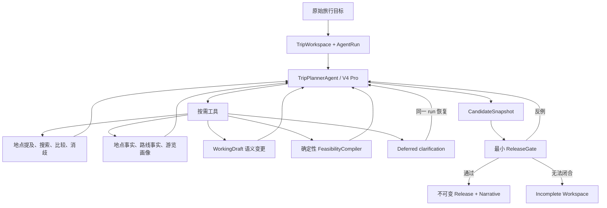

# Trajecta-Agent

Trajecta 是一个 AI-Native 旅行规划 Agent。用户直接提交完整旅行目标，唯一根 `TripPlannerAgent`
自主理解地点、搜索候选、补充事实、构建草案、模拟并提交发布候选；产品不再要求先走“识别 POI →
人工确认 → 才能规划”的 wizard。

模型拥有路线取舍，系统拥有事实与发布边界：地点 ID、坐标、路线、时间算术、最小硬约束、状态一致性
和发布资格都由严格领域模型与确定性 Python 代码控制。

## 当前产品流程

1. 用户输入原始旅行目标，可选填写目的地、日期和天数。
2. 系统立即创建长期 `TripWorkspace` 与一次有限生命周期的 `AgentRun`。
3. DeepSeek V4 Pro 根 Agent 按当前证据自主选择工具，不执行固定业务流水线。
4. 地点提及、候选比较、事实抽取和游览画像可按需调用 V4 Flash；它们没有独立目标或写权限。
5. Agent 尽早维护 `WorkingDraft`，确定性 Compiler 计算地点、交通、酒店、用餐和固定时段占用。
6. `submit_candidate` 冻结候选；ReleaseGate 返回全部结构化反例，最多允许三次候选提交。
7. 通过门禁后，Candidate、Release、受限 Narrative 与 `published` 终态在一个事务中写入。
8. 运行中的用户只能回答 Agent 主动发起的 1–5 个关键问题；发布后的修改创建 revision run。



## 核心边界

- 生产只有一个具有路线决策权的根 Agent。
- V4 Flash 结构化调用只提供建议或来源约束抽取，不能直接修改 Workspace。
- `ObservedClaim` 必须引用已保存 `SourceRecord`；Estimate 永远不能升级为 verified。
- `spatial_estimate` 只允许形成 degraded 发布。
- 父实体不能因类别或文本相似被子商户/子景点替代；未指定品牌不能任意绑定分店。
- 普通饭点、强度、跨区、普通“必去”和推荐时段是体验优化，不自动阻断发布。
- 只有事实不变量和用户明确不可调整的承诺能成为发布 blocker。
- 不存在 deterministic itinerary fallback；预算耗尽时保留 Agent 自己创建的最近草案，必要时 `incomplete`。
- Provider reasoning 只作为 opaque runtime transcript 持久化，不进入业务事实或用户界面。

## 本地启动

需要 Python 3、Node.js 和 pnpm。复制 `.env.example` 为本地 `.env` 后配置：

- `LLM_API_KEY`
- `LLM_BASE_URL`
- `AMAP_API_KEY`

V2 根模型固定为 `deepseek-v4-pro`，轻量结构化模型固定为 `deepseek-v4-flash`。后端会读取项目根目录
的本地环境配置；不要提交 `.env` 或本地 SQLite。

启动后端：

```bash
cd backend
python3 -m venv .venv
source .venv/bin/activate
pip install -r requirements.txt
uvicorn main:app --reload --port 8000
```

启动前端：

```bash
cd frontend
pnpm install
pnpm run dev
```

打开 `http://localhost:3000`。前端通过 `/api/backend/*` 代理到 FastAPI；跨机器部署时设置
`BACKEND_API_BASE_URL`。纯静态托管不会提供该服务端代理。

## V2 API

```text
POST /api/v2/trip-workspaces
GET  /api/v2/trip-workspaces/{workspace_id}
POST /api/v2/trip-workspaces/{workspace_id}/runs
POST /api/v2/trip-workspaces/{workspace_id}/revisions
GET  /api/v2/agent-runs/{run_id}
GET  /api/v2/agent-runs/{run_id}/events
POST /api/v2/agent-runs/{run_id}/answers
POST /api/v2/agent-runs/{run_id}/resume
POST /api/v2/agent-runs/{run_id}/cancel
```

URL 会保存 `workspace` 和 `run` 标识，刷新后恢复原目标、工作区、事件、澄清、Release 与 Narrative。

## 项目结构

- `backend/app/trip_agent/domain/`：V2 严格领域模型。
- `backend/app/trip_agent/agent/`：唯一根 Agent 与上下文合同。
- `backend/app/trip_agent/toolsets/`：高语义工具与写权限边界。
- `backend/app/trip_agent/runtime/`：预算、持久化、恢复和 run 生命周期。
- `backend/app/trip_agent/repositories/`：V2 SQLite 事务与幂等实现。
- `backend/app/trip_agent/validation/`：确定性 Compiler 与 ReleaseGate。
- `backend/app/trip_agent/api/`：V2 API。
- `frontend/components/agent-v2/`：Workspace、进度、澄清和发布 UI。
- `backend/evals/agent_v2/`：分层评测数据。
- `docs/agent-v2/`：ADR、实施状态和真实评测报告。

Legacy 执行代码暂时保留用于 shadow 对照、运行级回滚和历史行程只读展示，V2 不得导入 Legacy
规划决策模块。只有 WP8 切流 Gate 全部通过、V2 默认至少稳定 7 天并覆盖一次正式发布后，才删除
Legacy 执行路径；历史只读 adapter 按数据保留周期单独删除。

## 验证

```bash
backend/.venv/bin/pytest -q
backend/.venv/bin/python -m compileall -q backend/app backend/main.py
backend/.venv/bin/python backend/scripts/validate_agent_v2_datasets.py
cd frontend && pnpm test
cd frontend && ./node_modules/.bin/tsc --noEmit --incremental false
cd frontend && pnpm exec next build --webpack
```

真实供应商 V2 验收：

```bash
cd backend
.venv/bin/python scripts/run_trip_agent_v2_real_chain.py
.venv/bin/python scripts/run_agent_v2_live_evals.py \
  --task all --concurrency 3 --output-dir /tmp/agent-v2-eval-full
```

当前实现证据、R0～R4 修复和剩余 Gate 见
[WP8 修复记录](./docs/agent-v2/WP8_REPAIR_R0_R4_2026-07-18.md)；WP4～WP7 阶段证据见
[实施状态](./docs/agent-v2/WP4_WP7_IMPLEMENTATION_STATUS_2026-07-18.md)，详细架构见
[技术架构](./docs/ARCHITECTURE.md)。2026-07-18 全部会话的当前状态、风险和下一步入口见
[项目交接](./docs/agent-v2/HANDOFF_2026-07-18.md)。
