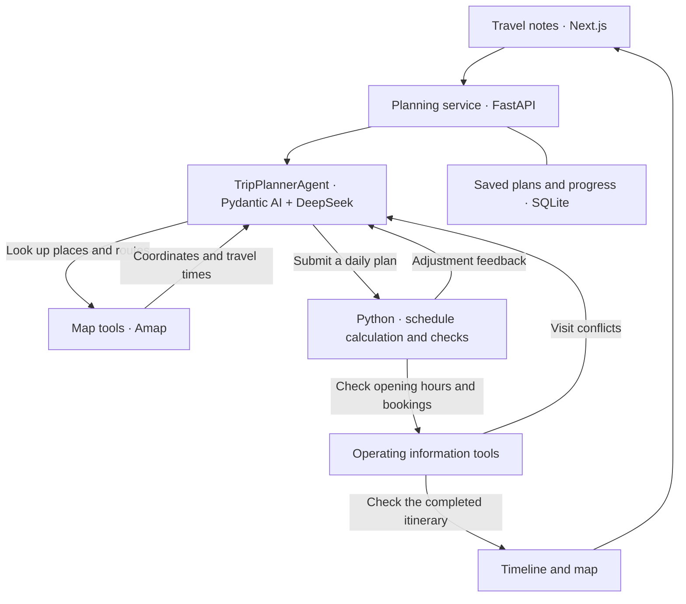

# Trajecta-Agent

**English** | [简体中文](./README.zh-CN.md)

Trajecta turns travel notes into daily itineraries with routes, meals, and a linked map.
A single `TripPlannerAgent` plans the trip; Python tools resolve places, retrieve route facts,
calculate times, and manage execution.


## Features

- **Place matching:** find saved places on the map and ask for clarification when names are ambiguous.
- **Itinerary planning:** distribute stops across days, arrange meals, and adjust the plan using route and timing feedback.
- **Saved progress:** resume interrupted planning and keep itineraries across page refreshes.
- **Linked timeline and map:** select stops, switch days, zoom, and open navigation links on desktop or mobile.

## Agent architecture

`TripPlannerAgent` uses Pydantic AI and DeepSeek to choose places, order stops, and arrange meals.
It calls Python tools to look up map candidates, retrieve routes, and calculate the daily schedule.
Tool results guide the next planning step: clarify a place, move a stop, or revise a day.



Pydantic models structure the Agent's tool inputs and outputs. Python calculates travel times
from route data and checks fixed bookings before displaying the completed itinerary. Missing
opening-hour information and comfort suggestions appear as reminders.

FastAPI runs planning in the background. SQLite stores plans and execution progress so interrupted
work can resume. Next.js presents the itinerary as a linked timeline and map.

## Quickstart

Requires Python 3, Node.js, and pnpm. Copy `.env.example` to `.env` and configure
`LLM_API_KEY`, `LLM_BASE_URL`, and `AMAP_API_KEY`.

Start the backend:

```bash
cd backend
python3 -m venv .venv
source .venv/bin/activate
pip install -r requirements.txt
uvicorn main:app --reload --port 8000
```

Start the frontend in another terminal:

```bash
cd frontend
pnpm install
pnpm run dev
```

Open [localhost:3000](http://localhost:3000). Choose **体验示例** to explore a sample itinerary,
or enter a destination, date, and travel notes to generate a trip. Set `BACKEND_API_BASE_URL`
when the backend runs on another host.
