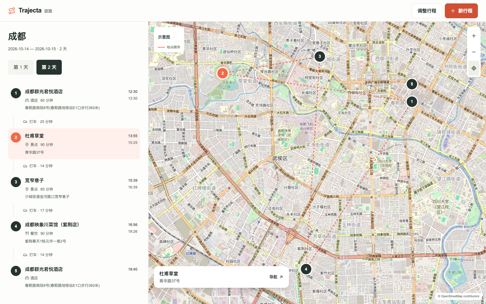
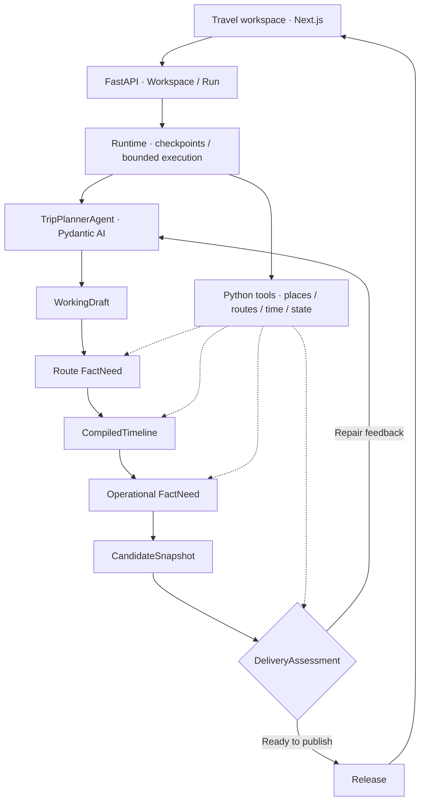

# Trajecta-Agent

**English** | [简体中文](./README.zh-CN.md)

Trajecta turns travel notes into daily itineraries with routes, meals, and a linked map.
A single `TripPlannerAgent` plans the trip; Python tools resolve places, retrieve route facts,
calculate times, and manage execution.



## Features

- **Place grounding:** resolve saved place names against map candidates and ask for clarification when needed.
- **Itinerary planning:** assign days, order stops, arrange meals, and repair drafts using tool feedback.
- **Persistent execution:** save checkpoints, resume the same Run, and preserve results across refreshes.
- **Linked timeline and map:** select stops, switch days, zoom, and open navigation links on desktop or mobile.

## Agent architecture

Built with Pydantic AI, DeepSeek, FastAPI, SQLite, and Next.js. Structured calls extract travel
requirements and allowed map queries. The Agent selects places and submits drafts through typed
tools. Python compiles route times, checks constraints, and publishes a Run-bound result.



Strict Pydantic models define the tool and data contracts. Versioned writes, idempotency keys,
and atomic publishing protect saved state. Fact quality and travel experience are recorded
separately. See [architecture details](./docs/agent-v3/ARCHITECTURE.md).

## Quickstart

Requires Python 3, Node.js, and pnpm. Copy `.env.example` to `.env` and configure
`LLM_API_KEY`, `LLM_BASE_URL`, and `AMAP_API_KEY`.

Start the backend:

```bash
cd backend
python3 -m venv .venv
source .venv/bin/activate
pip install -r requirements.txt
uvicorn main:app --reload --port 8000
```

Start the frontend in another terminal:

```bash
cd frontend
pnpm install
pnpm run dev
```

Open [localhost:3000](http://localhost:3000). Choose **体验示例** to explore a sample itinerary,
or enter a destination, date, and travel notes to generate a trip. Set `BACKEND_API_BASE_URL`
when the backend runs on another host.
