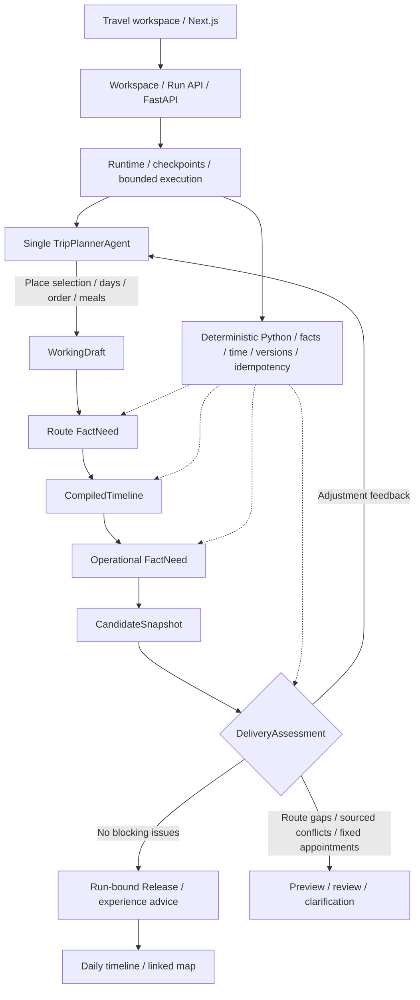

# Trajecta-Agent

**English** | [简体中文](./README.zh-CN.md)

Trajecta is a travel planning agent that turns source material into an itinerary. The repository
runs a single V3 stack. One `TripPlannerAgent` selects places, resolves ambiguity, assigns days,
orders stops, and arranges meals. Deterministic Python code owns place identity, route facts,
time calculations, state, idempotency, and release eligibility.

A completed run accounts for every explicit place and produces an executable timeline with
traceable route facts. Route gaps, estimates, confirmed operating conflicts, and fixed appointment
conflicts require draft repair. Place ambiguity can require user input. Missing public operating
information allows delivery with `fact_status=degraded`; pace and transport advice remain attached.

The frontend displays a daily timeline beside a linked map. It supports place selection, zoom,
pan, navigation links, and a fallback when map tiles fail. The home page's demo uses local sample
data. Generating a plan calls the model and place services.

The desktop trip form pairs inputs with a trip summary and provides preference shortcuts and
button feedback. During planning, the workspace shows runtime events, current tasks, tool names,
call durations, and total runtime. Pause, resume, and refresh retain the same run's records.
The completed page shows the daily timeline, linked map, place details, and sourced reservation
reminders. See the
[UI change and validation record](./docs/agent-v3/UI_EXPERIENCE_2026-10-03.md).


Recorded Chengdu itinerary from a real provider run, displayed in the current frontend.

## Run locally

Install Python 3, Node.js, and pnpm. Copy `.env.example` to a local `.env` and configure
`LLM_API_KEY`, `LLM_BASE_URL`, and `AMAP_API_KEY`. Keep `.env` and local SQLite files out of Git.

```bash
cd backend
python3 -m venv .venv
source .venv/bin/activate
pip install -r requirements.txt
uvicorn main:app --reload --port 8000
```

```bash
cd frontend
pnpm install
pnpm run dev
```

Open `http://localhost:3000`. The frontend proxies FastAPI through `/api/backend/*`.
Set `BACKEND_API_BASE_URL` when the backend runs on another host.

## API

```text
GET  /health
POST /api/v3/trip-workspaces
GET  /api/v3/trip-workspaces/{workspace_id}
POST /api/v3/trip-workspaces/{workspace_id}/runs
POST /api/v3/trip-workspaces/{workspace_id}/revisions
GET  /api/v3/agent-runs/{run_id}
GET  /api/v3/agent-runs/{run_id}/events
GET  /api/v3/agent-runs/{run_id}/metrics
GET  /api/v3/agent-runs/{run_id}/delivery
POST /api/v3/agent-runs/{run_id}/resume
POST /api/v3/agent-runs/{run_id}/answers
POST /api/v3/agent-runs/{run_id}/cancel
```

The page URL stores `workspace` and `run`. Refresh restores that run, and delivery reads use
its bound Release.

## Agent architecture and data flow

Constrained structured calls turn source material into a `RequirementLedger` and a `QueryPlan`
that defines allowed map queries. Each place retains up to three candidates. Decisions are stored
in the `GroundingRegistry`. One `TripPlannerAgent` chooses places and prepares the draft.
The Runtime saves checkpoints. Deterministic Python code retrieves facts, compiles time,
and assesses delivery.



Route facts produce the timeline first. Operational facts are then queried for the actual visit
times. Zero blocking issues allow a Release bound to the current run. Missing ordinary operating
information retains its degraded fact status; experience advice remains separate. Strict Pydantic
models, versioned writes, provider-valid recovery transcripts, and atomic release commits enforce
the execution boundaries. See the [V3 architecture](./docs/agent-v3/ARCHITECTURE.md).

## Project structure

- `backend/app/trip_agent_v3/`: domain models, single-agent Runtime, provider adapters, facts, and delivery.
- `backend/tests/trip_agent_v3/`: domain, integration, API, architecture, and travel risk tests.
- `backend/evals/agent_v3/`: 30 provider scenarios across six cities and trips of one to five days.
- `backend/scripts/run_trip_agent_v3_shadow.py`: auditable provider evaluation runner.
- `frontend/components/agent-v3/`: trip input, place confirmation, timeline, map, and appointment reminders.
- `docs/agent-v3/`: architecture, acceptance criteria, provider evidence, and cutover records.

See the [2026-10-02 redesign record](./docs/agent-v3/REDESIGN_2026-10-02.md) for the recent
architecture and product changes.

See the [2026-10-03 cleanup audit](./docs/agent-v3/CLEANUP_2026-10-03.md) for removed legacy
code, active configuration, runtime consumers, and validation results.

V1 and V2 execution code, routes, frontend, tests, scripts, and evaluation datasets were removed
on 2026-08-01.

## Validation

```bash
backend/.venv/bin/pytest -q
backend/.venv/bin/python -m compileall -q backend/app backend/main.py
backend/.venv/bin/python backend/scripts/run_trip_agent_v3_shadow.py \
  --validate-corpus-only --output-dir /tmp/trajecta-v3-corpus-check
cd frontend && pnpm test
cd frontend && ./node_modules/.bin/tsc --noEmit --incremental false
cd frontend && pnpm exec next build --webpack
```

The 2026-10-03 check passed 235 backend tests, 20 frontend tests, the production build,
and browser workflows with controlled provider fixtures. A new real-provider run paused
on DeepSeek HTTP 402. See the [user acceptance record](./docs/agent-v3/USER_ACCEPTANCE_2026-10-03.md).

The historical provider evaluation started 16 of 30 scenarios. Manual review passed two of
five Releases. The remaining 14 scenarios were stopped at the user's request on 2026-08-01.
See the [migration record](./docs/agent-v3/MIGRATION_AND_CUTOVER.md) and
[partial evaluation evidence](./docs/agent-v3/PARTIAL_DISTRIBUTION_2026-07-31.md).
