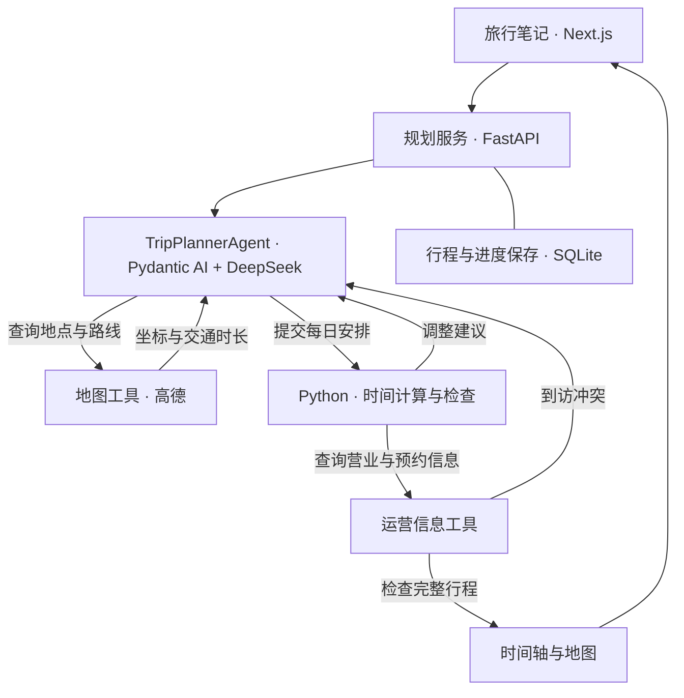

# Trajecta-Agent

[English](./README.md) | **简体中文**

Trajecta 将旅行笔记整理成包含路线、餐饮和联动地图的每日行程。
单个 `TripPlannerAgent` 规划旅程；Python 工具负责地点匹配、路线查询、时间计算和执行状态。


## 功能

- **地点匹配**：根据地图候选确定收藏地点，存在歧义时请求用户确认。
- **行程规划**：分配日期、排序地点、安排餐饮，并根据路线和时间反馈调整行程。
- **保存进度**：接续中断的规划，刷新页面后保留行程。
- **时间轴与地图联动**：支持地点选择、日期切换、缩放和导航链接，适配电脑与手机。

## Agent 架构

`TripPlannerAgent` 基于 Pydantic AI 和 DeepSeek，负责地点取舍、停靠顺序和餐饮安排。
它调用 Python 工具查询地图候选、获取路线、计算每日时间表，再根据工具结果继续规划：
确认地点、移动停靠点，或调整某一天的安排。



Pydantic 模型定义 Agent 工具的输入与输出。Python 根据路线数据计算交通时间，
核对固定预约后展示完整行程。营业信息缺失和舒适度建议随行程呈现为提醒。

FastAPI 在后台执行规划，SQLite 保存行程和执行进度，支持中断后接续。
Next.js 将结果呈现为联动的时间轴与地图。

## 快速启动

需要 Python 3、Node.js 和 pnpm。复制 `.env.example` 为 `.env`，配置
`LLM_API_KEY`、`LLM_BASE_URL` 和 `AMAP_API_KEY`。

启动后端：

```bash
cd backend
python3 -m venv .venv
source .venv/bin/activate
pip install -r requirements.txt
uvicorn main:app --reload --port 8000
```

在另一个终端启动前端：

```bash
cd frontend
pnpm install
pnpm run dev
```

打开 [localhost:3000](http://localhost:3000)。点击 **体验示例** 浏览示例行程，
或输入目的地、日期和旅行笔记生成规划。后端部署在其他主机时，设置 `BACKEND_API_BASE_URL`。
