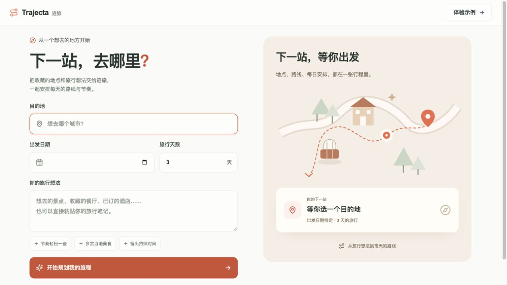
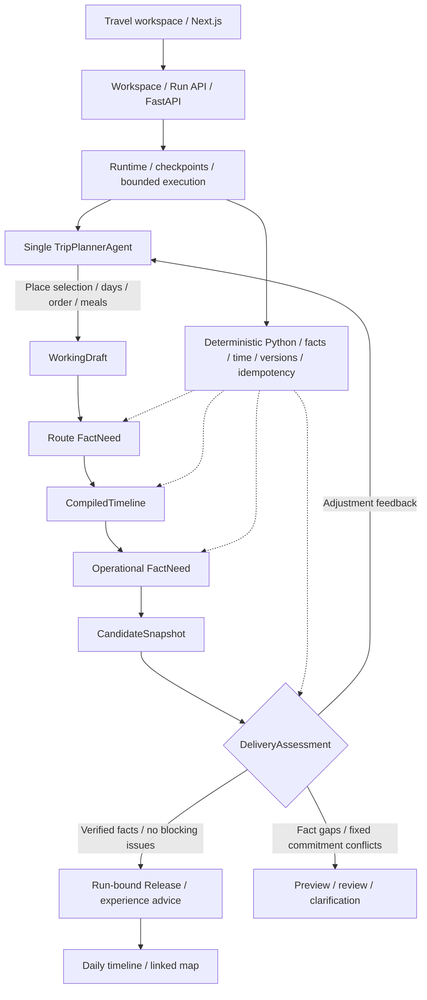

# Trajecta-Agent

[English](./README.md) | **简体中文**

Trajecta 是资料驱动的旅行规划 Agent。当前仓库只保留 V3 单栈：一个根
`TripPlannerAgent` 负责地点取舍、消歧、分天、排序和餐饮安排；确定性 Python 代码负责
地点身份、路线事实、时间算术、状态、幂等和发布资格。

系统的完成条件是当前运行形成一份显式地点全部处置、逐段时间可执行、
关键事实可追溯的旅行方案。路线估算、关键事实缺口、未完成地点确认和固定预约冲突会保留
明确提示的行程预览；事实已核验的行程可以带节奏、长日与交通偏好建议完成交付。

前端使用旅行工作台：每日时间轴与地图同屏，点击地点联动，支持缩放、拖动、地点导航和
底图失败回退。首页的“体验示例”使用本地示例数据，生成规划时才调用模型与地点服务。

电脑端新建行程采用双栏表单与旅行摘要，支持快捷填入偏好和按钮动效。规划期间显示真实
事件、当前任务、工具名称、单次耗时和累计运行时间；暂停、继续及刷新后保留同一运行的记录。
完成后的地图页面可展开查看规划记录。改动与验收见
[交互体验记录](./docs/agent-v3/UI_EXPERIENCE_2026-10-03.md)。



## 本地启动

需要 Python 3、Node.js 和 pnpm。复制 `.env.example` 为本地 `.env`，配置 `LLM_API_KEY`、`LLM_BASE_URL` 和
`AMAP_API_KEY`。不要提交 `.env` 或本地 SQLite。

```bash
cd backend
python3 -m venv .venv
source .venv/bin/activate
pip install -r requirements.txt
uvicorn main:app --reload --port 8000
```

```bash
cd frontend
pnpm install
pnpm run dev
```

打开 `http://localhost:3000`。前端通过 `/api/backend/*` 代理 FastAPI；跨机器部署时设置
`BACKEND_API_BASE_URL`。

## API

```text
GET  /health
POST /api/v3/trip-workspaces
GET  /api/v3/trip-workspaces/{workspace_id}
POST /api/v3/trip-workspaces/{workspace_id}/runs
POST /api/v3/trip-workspaces/{workspace_id}/revisions
GET  /api/v3/agent-runs/{run_id}
GET  /api/v3/agent-runs/{run_id}/events
GET  /api/v3/agent-runs/{run_id}/metrics
GET  /api/v3/agent-runs/{run_id}/delivery
POST /api/v3/agent-runs/{run_id}/resume
POST /api/v3/agent-runs/{run_id}/answers
POST /api/v3/agent-runs/{run_id}/cancel
```

页面 URL 保存 `workspace` 和 `run`，刷新后严格恢复该运行。交付读取不会回退到工作区其他
运行的 Release。

## Agent 架构与核心数据流

资料先经过受限结构化理解，形成 `RequirementLedger` 与地图查询白名单 `QueryPlan`。
每个地点最多保留 3 个候选，消歧结果存入 `GroundingRegistry`。单个 `TripPlannerAgent`
负责地点取舍与行程草案；Runtime 保存检查点，确定性 Python 代码查询事实、编译时间并评估交付。



路线事实先生成时间线，运营事实按实际到访时刻查询。事实已核验且没有阻断问题时形成
绑定当前运行的 Release，体验建议随行程保留。详细边界见 [V3 架构](./docs/agent-v3/ARCHITECTURE.md)。

## 项目结构

- `backend/app/trip_agent_v3/`：领域模型、单根 Agent Runtime、provider adapters、事实与交付。
- `backend/tests/trip_agent_v3/`：领域、集成、API、架构和真实旅程风险矩阵。
- `backend/evals/agent_v3/`：30 条、6 城市、1～5 天真实 provider 语料。
- `backend/scripts/run_trip_agent_v3_shadow.py`：可审计真实 provider 分布运行器。
- `frontend/components/agent-v3/`：行程录入、待确认地点、时间轴、地图和预约提醒。
- `docs/agent-v3/`：当前架构、验收、真实证据和切流记录。

2026-10-02 的架构与产品调整见 [本次改造说明](./docs/agent-v3/REDESIGN_2026-10-02.md)。

V1 与 V2 的执行代码、路由、前端、测试、脚本和评测集已于 2026-08-01 删除。

## 验证

```bash
backend/.venv/bin/pytest -q
backend/.venv/bin/python -m compileall -q backend/app backend/main.py
backend/.venv/bin/python backend/scripts/run_trip_agent_v3_shadow.py \
  --validate-corpus-only --output-dir /tmp/trajecta-v3-corpus-check
cd frontend && pnpm test
cd frontend && ./node_modules/.bin/tsc --noEmit --incremental false
cd frontend && pnpm exec next build --webpack
```

真实 provider 历史分布启动了 16/30 个场景，5 个 Release 的人工复核为 2/5。
剩余 14 个场景于 2026-08-01 按用户要求终止。详见 [迁移记录](./docs/agent-v3/MIGRATION_AND_CUTOVER.md) 和
[部分分布证据](./docs/agent-v3/PARTIAL_DISTRIBUTION_2026-07-31.md)。
