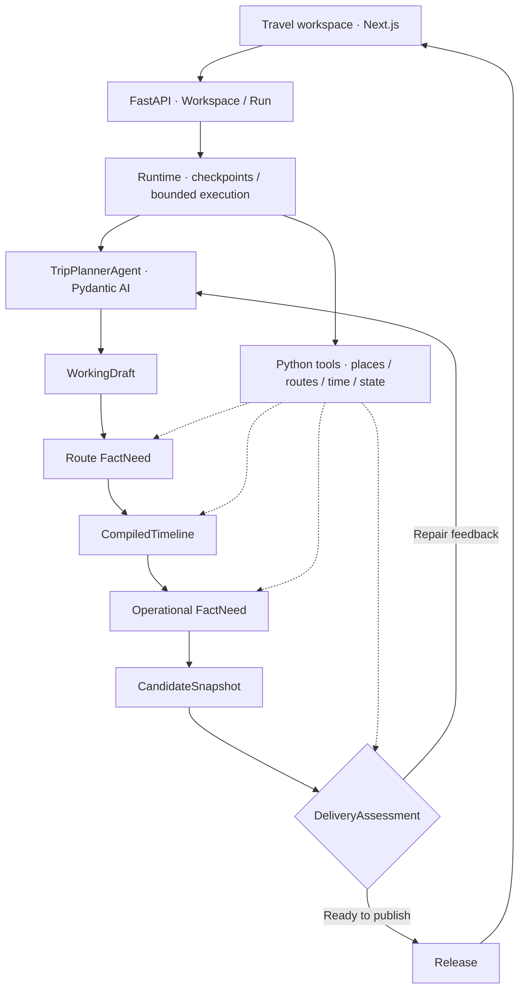

# Trajecta-Agent

[English](./README.md) | **简体中文**

Trajecta 将旅行笔记整理成包含路线、餐饮和联动地图的每日行程。
单个 `TripPlannerAgent` 规划旅程；Python 工具负责地点匹配、路线查询、时间计算和执行状态。


## 功能

- **地点匹配**：根据地图候选确定收藏地点，存在歧义时请求用户确认。
- **行程规划**：分配日期、排序地点、安排餐饮，并根据工具反馈修复草案。
- **持久化执行**：保存检查点、恢复同一个 Run，刷新后保留规划结果。
- **时间轴与地图联动**：支持地点选择、日期切换、缩放和导航链接，适配电脑与手机。

## Agent 架构

技术栈采用 Pydantic AI、DeepSeek、FastAPI、SQLite 和 Next.js。受限结构化调用提取旅行需求
和地图查询范围。Agent 通过类型明确的工具选择地点、提交草案。Python 编译路线时间、
检查约束，并发布绑定当前 Run 的结果。



严格 Pydantic 模型定义工具和数据契约。带版本的写入、幂等键和原子发布保护持久化状态。
事实质量与旅行体验分别记录。

## 快速启动

需要 Python 3、Node.js 和 pnpm。复制 `.env.example` 为 `.env`，配置
`LLM_API_KEY`、`LLM_BASE_URL` 和 `AMAP_API_KEY`。

启动后端：

```bash
cd backend
python3 -m venv .venv
source .venv/bin/activate
pip install -r requirements.txt
uvicorn main:app --reload --port 8000
```

在另一个终端启动前端：

```bash
cd frontend
pnpm install
pnpm run dev
```

打开 [localhost:3000](http://localhost:3000)。点击 **体验示例** 浏览示例行程，
或输入目的地、日期和旅行笔记生成规划。后端部署在其他主机时，设置 `BACKEND_API_BASE_URL`。
