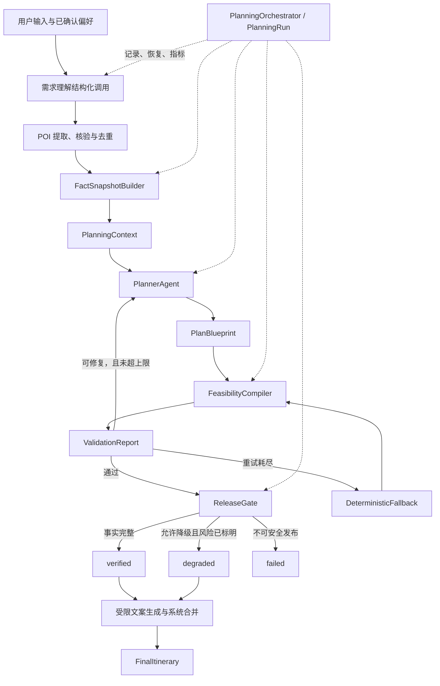

# Travel Agent 重构方案与实施计划

> 状态：已实施并完成本轮验收，作为重构设计基准
> 日期：2026-07-15
> 实施目录：`/Users/wk/Documents/产品设计/Agent开发`
> 现状基线与测试报告：`/Users/wk/Documents/产品设计/Travel/开发`
> 验收结果：`docs/AGENT_REFACTOR_ACCEPTANCE.md`

## 全流程目标

本次重构要把当前“多段 LLM 调用拼接出的旅行规划流程”升级为一个边界清晰、可修复、可恢复的旅行规划 Agent：系统从用户的非结构化游记和偏好中理解真实需求，以已核验的地点、路线和时间事实为基础，由唯一的 `PlannerAgent` 负责取舍地点、安排分天与顺序、生成路线蓝图，并根据结构化校验结果修正方案；地图事实、地点合法性、交通耗时、每日时间线、硬约束和发布资格继续由普通 Python 服务负责。全链路使用明确的 Pydantic 领域模型传递数据，使每一个输入、决策、事实、错误和最终结果都可验证、可追踪、可回放。

产品最终要交付的不是“模型成功返回了一段 JSON”，而是一条在模型波动和高德 API 限流、超时或局部失败时仍能稳定结束的任务流程：结构错误和业务错误均采用有上限的修复循环，外部事实请求采用退避重试，仍失败时只允许产生标明依据与风险的降级草案或明确失败，绝不将未核验结果伪装成完成；文案生成不得改变路线事实。系统持续记录硬约束通过率、事实完整率、修复与回退次数、模型调用量、响应时间、降级率和最终发布成功率，以“用户可以直接执行且系统诚实表达置信边界”作为完成标准。

## 1. 已确认决策

1. 仅在当前 `Agent开发` 工作区实施重构，原 `Travel/开发` 目录保留为现状基线和真实测试报告来源。
2. 第一版继续使用 DeepSeek V4，不在本轮同时更换模型供应商。
3. 高德 API 的限流、超时和临时服务错误先按 `Retry-After` 或指数退避重试；达到上限后允许降级，但结果必须显式携带降级状态、缺失事实和用户风险。
4. 核心只设置一个具有领域决策职责的 `PlannerAgent`。游记理解、时长估算和文案生成可以保留为结构化模型调用，但不包装为拥有自主循环的领域 Agent。
5. PydanticAI 只负责模型适配、类型化依赖、结构化输出、只读工具调用和结构修复；工作流编排、事实获取、时间编译、业务校验、状态持久化和发布门禁由普通 Python 代码负责。
6. 第一版不引入 Temporal、DBOS 或多 Agent 框架。先在现有 FastAPI、SQLite 和前端架构上建立可恢复的 `PlanningRun`；只有出现多实例、跨进程长任务或更严格的 exactly-once 需求时再升级持久化执行引擎。

## 2. 产品问题与根因判断

现有产品已经具备完整业务链：游记理解、地点抽取与高德核验、候选池、人机确认、路线矩阵、分天规划、时间线归一化、规则校验、重规划、确定性回退和文案发布。它不是“没有 Agent 能力”，而是模型决策、确定性执行和发布门禁仍混在以 `dict` 为主的调用链中，导致错误边界模糊、修复反馈不稳定、状态难以恢复，最终把“技术完成”误当成“行程可直接执行”。

2026-07-12 的 10 次真实全量流程测试中，8 次技术完成、2 次因高德外部依赖失败，但 8 个完成结果均未达到直接可用标准；典型问题包括单日 587～930 分钟、正餐缺失、天数文案漂移、暂停营业地点进入主路线和语义重复地点。这说明首要问题不是缺少更多模型自主性，而是缺少统一领域模型、事实快照、可行性编译器、分级发布门禁、显式降级语义和可恢复运行记录。

## 3. 范围与非目标

### 本轮范围

- 将核心规划上下文、蓝图、事实、校验报告和最终行程迁移到 Pydantic 模型。
- 接入 PydanticAI，并将核心路线蓝图生成与修复迁移到唯一 `PlannerAgent`。
- 抽离事实快照构建、时间线编译、业务校验和发布门禁。
- 建立结构修复、业务修复、网络重试和确定性回退四类有限策略。
- 将 `planning_runs` 升级为可追踪阶段、可保存中间产物、可重入恢复的任务记录。
- 前端展示真实任务阶段以及 `verified`、`degraded`、`failed` 结果状态。
- 建立离线回归、故障注入、影子对比和真实 API 重复验收。

### 非目标

- 不让模型创建不存在的地点、坐标、营业状态、票价或交通耗时。
- 不让模型直接修改已经编译并验证的路线事实。
- 不引入多个协作 Agent、开放式自主循环或模型自行决定何时发布。
- 不在本轮同时重写 FastAPI、Next.js、SQLite 或高德服务。
- 不承诺高德事实完全缺失时仍生成“已验证”行程。

## 4. 目标架构



### 4.1 职责边界

| 组件 | 负责 | 明确不负责 |
|---|---|---|
| `PlannerAgent` | 理解规划目标，选择候选地点，分天，排序，安排餐饮时段，根据校验报告修复蓝图 | 创建地图事实，计算真实交通时间，生成最终时间线，决定发布状态 |
| `PlanningOrchestrator` | 推进阶段、限制重试、持久化中间产物、恢复任务、汇总指标 | 代替领域规则做隐式判断 |
| `FactSnapshotBuilder` | 固化本次运行使用的 POI、酒店、路线、来源、更新时间与降级标记 | 安排行程 |
| `FeasibilityCompiler` | 将蓝图编译为分钟级时间线，补路线边，检查营业、强度、餐饮、顺序和硬约束 | 自由改写蓝图 |
| `ReleaseGate` | 根据结构化问题和事实完整性给出 `verified/degraded/failed` | 依赖文案模型判断事实是否正确 |
| 结构化辅助调用 | 游记理解、访问时长建议、最终文案字段 | 形成开放式自主循环或修改已确认事实 |
| 前端 | 展示阶段、恢复状态、降级原因和用户可采取的动作 | 用“已完成”掩盖事实缺失 |

## 5. 核心领域模型

所有模型均禁止静默接受未知字段；边界适配层显式完成旧 `dict` 与新模型之间的转换。

### 5.1 输入与事实

- `UserProfile`：目的地、日期、天数、住宿、出发/结束点、交通偏好、兴趣和约束。预算和人数在缺少真实决策能力前不进入产品输入。
- `PlanningPreference`：必须安排、可选、排除、邻近安排、顺序约束和时间约束。
- `GroundedPOI`：稳定 ID、规范名称、坐标、地址、类型、营业状态、核验级别、来源和别名。
- `HotelAnchor`：住宿锚点及其核验状态；不得作为普通景点进入行程。
- `RouteEdge`：起终点 ID、方式、时长、距离、来源、获取时间、精度和降级原因。
- `FactSnapshot`：本次规划使用的地点和路线事实闭包，带版本、完整性和缺口。

### 5.2 Agent 输入输出

- `PlanningContext`：用户画像、候选地点、事实摘要、日程窗口、餐饮规则、节奏策略、历史蓝图和最近一次校验报告。
- `PlanBlueprint`：严格只包含每日地点顺序、地点角色、建议时段、餐饮安排、未采用地点及理由，不含坐标和虚构交通数据。
- `BlueprintDay` / `BlueprintStop`：保证天数连续、POI ID 来自候选集、同一地点不可被重复安排。
- `RepairRequest`：旧蓝图、结构化问题、可变字段范围和剩余修复次数。

### 5.3 编译、校验与发布

- `TimelineItem` / `CompiledDay`：确定性编译后的到达、访问、离开、交通和用餐时间。
- `ValidationIssue`：稳定问题码、严重级别、位置、证据、可否由 Agent 修复和用户可读说明。
- `ValidationReport`：`passed`、事实问题、业务问题、偏好偏差、建议修复动作和使用的事实版本。
- `ReleaseDecision`：`verified/degraded/failed`、阻断项、降级项和允许用户继续的动作。
- `FinalItinerary`：只从编译结果和系统事实构建；模型生成的文案以受限 `CopyPatch` 合并。
- `PlanningRunRecord`：运行 ID、阶段、尝试次数、状态、检查点、中间产物、指标和错误摘要。

### 5.4 初始节奏策略

将“体验目标”和“绝对上限”分离，避免当前低强度与中强度同为 420 分钟，也避免高强度路线无限膨胀。首版默认值如下，后续只根据真实评测调整配置，不由模型修改：

| 强度 | 体验目标 | 单日绝对上限 |
|---|---:|---:|
| low | 420 分钟 | 540 分钟 |
| medium | 540 分钟 | 660 分钟 |
| high | 660 分钟 | 780 分钟 |

超过体验目标属于需优化偏差；超过绝对上限属于发布阻断。出发日、返程日和用户明确时间窗口可以进一步收紧，不可放宽绝对上限。

## 6. PlannerAgent 设计

### 6.1 依赖与输出

`PlannerAgent` 使用类型化 `PlannerDependencies` 注入 `FactSnapshot`、用户偏好和节奏；输出先经过严格 `PlannerTurn`，可主动请求一次影响决策的日期营业事实，随后必须提交或修正 `PlanBlueprint`。Prompt 只描述决策目标、压缩事实、取舍优先级和事实所有权，不携带网页正文。

### 6.2 允许的只读工具

1. `get_place_details(poi_ids)`：读取候选集中地点的规范事实。
2. `get_route_facts(pairs)`：读取事实快照中已有路线边，不触发模型创建路线数据。

工具参数中的 ID 必须属于当前上下文。最终业务校验不作为 Agent 可绕过的工具；`FeasibilityCompiler` 和 `ReleaseGate` 在 Agent 运行外独立执行。

### 6.3 两层修复

- **结构层修复**：Pydantic 输出解析或 `output_validator` 发现未知 POI、重复安排、天数不连续等蓝图内部问题时，将结构化错误反馈给模型，最多重试 2 次。
- **业务层修复**：精确路线和时间线编译后，固定预约、已知闭馆等最小不变量必须修正；餐饮、普通时段、顺序和舒适度作为一次聚合评价交回同一个 `PlannerAgent`，最多重新规划 1 次。

任一循环都必须有独立计数器和总模型调用上限，不能因错误类型切换而形成隐式无限循环。

## 7. 工作流与状态机

`PlanningRun` 按以下阶段持久化，每个阶段均满足幂等或可根据检查点安全重放：

1. `understanding`：结构化用户输入和游记内容。
2. `grounding`：地点核验、语义去重、酒店锚点确认。
3. `fact_snapshot`：构建候选地点与路线事实快照。
4. `blueprint`：首次运行 `PlannerAgent`。
5. `compiling`：生成精确路线与分钟级时间线。
6. `repairing`：保存报告并执行有限业务修复。
7. `fallback`：修复耗尽后运行确定性蓝图回退。
8. `release_gate`：决定 `verified/degraded/failed`。
9. `copywriting`：仅生成允许变更的文案字段。
10. `completed`：持久化最终行程、验证报告和指标。

进程重启或前端断线时，后端根据最近一个已完成检查点继续；同一 session 的运行使用幂等键防止重复规划。已进入终态的运行不得被后续异常覆盖为另一个终态。

## 8. 重试、降级与失败策略

| 失败类型 | 策略 | 上限 | 耗尽后的结果 |
|---|---|---:|---|
| LLM 网络、429、5xx | 尊重 `Retry-After`，否则指数退避加抖动 | 3 次 | 进入确定性回退或 `failed` |
| LLM 输出结构错误 | PydanticAI 结构化反馈 | 2 次 | 确定性蓝图回退 |
| 业务约束不通过 | `ValidationReport` 驱动同一 Agent 修复 | 2 次 | 确定性蓝图回退并重新校验 |
| 高德地点搜索/地理编码临时失败 | 退避重试 | 3 次 | 非关键候选可排除；酒店或起终点缺失则要求确认或失败 |
| 已选路线边临时失败 | 退避重试，读取有效缓存 | 3 次 | 可用空间估算时标记 `degraded`；无合理估算则失败 |
| 文案调用失败 | 退避重试 | 2 次 | 使用确定性模板，不影响路线事实 |

高德降级路线边必须记录 `source=spatial_estimate`、估算方法和风险提示，不能写成高德精确路线；缓存必须携带 TTL、来源和获取时间，过期缓存只能作为降级依据。

## 9. 发布门禁

### `verified`

- 所有使用中的 POI、酒店锚点和路线边均有可接受的事实来源。
- 天数、日期、起终点、POI 唯一性、必须/排除地点、顺序和用户硬时间窗全部通过。
- 每日时间线连续，无负时长、重叠、未知地点或不可能交通。
- 正常全天行程存在明确午餐和晚餐策略；营业暂停、永久关闭、语义重复地点不得进入主路线。
- 单日不超过对应强度绝对上限。

### `degraded`

- 所有硬业务约束通过，但存在被允许的局部事实降级，例如个别路线边使用空间估算。
- 缺失事实、估算依据、影响范围和建议用户复核动作均显式展示。
- 酒店位置、主目的地或关键起终点不确定时不得降级发布。

### `failed`

- 任一硬约束无法满足，事实不足以生成安全路线，或确定性回退仍未通过发布门禁。
- 返回稳定错误码、失败阶段、已尝试策略和可执行的下一步，不只返回通用错误文案。

## 10. 数据、API 与前端迁移

### 10.1 `planning_runs`

在现有表上增加：`result_status`、`checkpoint`、`input_snapshot`、`fact_snapshot`、`blueprint`、`validation_report`、`release_decision`、`metrics`、`error_code` 和 `idempotency_key`。大字段首版继续使用 JSON 文本，统一由 Pydantic 序列化与反序列化。

### 10.2 API

- 启动规划返回 `run_id` 和当前阶段，不以请求连接是否持续作为任务存活依据。
- 查询接口返回阶段、尝试次数、最近检查点、终态和结构化错误。
- 行程接口返回 `result_status`、`verification`、`degradation_reasons` 和事实版本。
- 保留现有同步接口作为兼容层，内部转到新编排器；前端切换完成后再决定是否移除。

### 10.3 前端

- 把单一 `running/completed/failed` 扩展为可读阶段与 `verified/degraded/failed` 终态。
- `degraded` 必须展示缺失事实、估算路段和复核建议。
- 网络断开后按 `run_id` 恢复，不重复创建规划任务。
- 用户可见文案使用普通旅行者语言，不暴露内部 schema、POI 技术字段或模型错误原文。

## 11. 目标目录结构

```text
backend/app/
  domain/
    common.py
    user.py
    facts.py
    planning.py
    validation.py
    itinerary.py
    run.py
  agents/
    planner_agent.py
    structured_calls.py
  orchestration/
    planning_orchestrator.py
    retry_policy.py
    checkpoints.py
  planning/
    context_builder.py
    fact_snapshot.py
    feasibility_compiler.py
    deterministic_fallback.py
    release_gate.py
    copy_merger.py
  adapters/
    legacy.py
    deepseek.py
    amap.py
```

旧模块在迁移期间作为兼容适配器保留；只有影子对比和回归通过后才删除手写 JSON Schema、重复 normalizer 和旧规划入口。

## 12. 分阶段实施计划

### 阶段 0：冻结基线与兼容性验证

- 固化现有 221 个后端测试和 16 个前端测试的基线结果。
- 将真实 10 场景报告转成可重放的评测清单，剥离密钥和不可复现响应。
- 对 PydanticAI + DeepSeek V4 做最小 spike：结构化输出、`ModelRetry`、工具调用、`thinking` 参数和超时/429 行为。
- 根据 spike 固定依赖版本；若原生 structured output 不兼容，则使用 PydanticAI 的 tool/native 兼容模式，不退回手写 schema 主流程。

退出条件：DeepSeek 最小链路可运行，兼容模式和依赖版本有自动测试，现有基线无回退。

### 阶段 1：领域模型与旧逻辑适配

- 新建 `domain` 模型和严格验证规则。
- 为现有数据库、路线服务、planner、normalizer、verifier 建立显式转换器。
- 首先以模型包裹旧流程，不改变外部 API 和规划结果。

退出条件：核心模型可往返序列化；旧流程全量测试通过；非法 POI ID、重复地点、断裂天数和未知字段有单测。

### 阶段 2：PlannerAgent 影子模式

- 实现类型化依赖、`PlannerTurn` 主动事实请求、`PlanBlueprint` 路线输出和结构层重试。
- 在不影响用户结果的情况下同时运行旧 planner 与新 Agent，记录蓝图差异、调用数、耗时和结构失败。
- 建立固定事实快照的离线评测，避免用波动地图数据判断纯规划质量。

退出条件：影子评测无未知地点和结构错误；硬约束通过率不低于旧 planner；模型调用有明确上限。

### 阶段 3：确定性编译与发布门禁

- 抽离 `FactSnapshotBuilder`、`FeasibilityCompiler`、`ValidationReport` 和 `ReleaseGate`。
- 落实节奏目标/上限、餐饮、营业状态、语义去重、酒店角色和文案事实保护。
- 引入高德退避、缓存元数据和路线边降级标记。

退出条件：报告中 587～930 分钟、漏餐、暂停营业、语义重复和天数文案漂移均有回归测试并被阻断或修复。

### 阶段 4：新编排器、有限修复与持久化恢复

- 实现 `PlanningOrchestrator`、两层修复计数、确定性回退和终态规则。
- 升级 `planning_runs` 检查点；支持进程重启、连接中断和重复请求恢复。
- 为各阶段写入结构化指标和错误码。

退出条件：故障注入可证明无无限循环、无重复任务、无“失败却 completed”；从每个持久化检查点均可恢复或安全重放。

### 阶段 5：API、前端与切流

- 新编排器先灰度到内部开关，再成为默认路径。
- 前端按 `run_id` 展示阶段和三类终态，补齐降级说明。
- 保留旧路径一段观察期；新路径满足验收后删除手写 schema 和重复规划逻辑。

退出条件：前后端契约测试、类型检查、构建和端到端恢复测试通过；关闭旧路径不影响现有主流程。

### 阶段 6：真实验收与文档收口

- 使用真实 DeepSeek 与高德 API 重跑原 10 场景，并补充限流、超时、空结果、旧缓存和文案失败注入。
- 分开报告技术完成率、外部依赖失败、事实正确性、直接可执行率、降级率和文案漂移。
- 更新 README、运行说明、领域模型、错误码、指标和运维排障文档。

退出条件：达到第 13 节验收标准；所有未达项有证据、负责人和后续计划，不以测试绿灯替代产品验收。

## 13. 验收标准

### 自动化质量

- 现有后端、前端测试全部通过，新模块具备模型校验、状态机、重试、降级、恢复和发布门禁测试。
- 核心领域层不再以裸 `dict` 作为公共接口；兼容层之外不维护手写 JSON Schema。
- 任何调用链均有总尝试上限，故障注入测试证明不会无限循环。
- 文案调用前后对天数、日期、POI ID、顺序、到离时间和交通事实做不可变性对比，漂移数为 0。

### 产品质量

- 不允许“硬约束不通过但状态为 completed/verified”，目标为 0 次。
- 原报告涉及的极端时长、漏餐、暂停营业、重复地点和天数漂移均为 0 次直接发布。
- 使用固定事实快照重复运行时，结构成功率和发布门禁确定性为 100%。
- 真实 10 场景每次必须落到 `verified`、带明确理由的 `degraded` 或带稳定错误码的 `failed`，不出现无解释中断。
- `verified` 行程硬约束通过率 100%；`degraded` 行程硬约束通过率 100%，且降级事实展示率 100%。

### 持续指标

- `hard_constraint_pass_rate`
- `fact_completeness_rate`
- `model_call_count`
- `schema_retry_count`
- `business_repair_count`
- `deterministic_fallback_rate`
- `amap_degradation_rate`
- `verified/degraded/failed_rate`
- `planning_latency_p50/p95`
- `final_publish_success_rate`
- `copy_fact_drift_count`

首轮重构先建立基线，不人为设定无法由现有样本支撑的延迟和成本目标；完成两轮真实回归后再据分布设 SLO。

## 14. 风险与控制

- **PydanticAI/DeepSeek 兼容差异**：先 spike 再固定版本，通过 provider 适配层隔离非标准参数。
- **一次性迁移风险**：领域模型、Agent、编译器和编排器分阶段切换，旧路径只在可对比阶段保留。
- **严格门禁导致发布率短期下降**：这是暴露真实质量，不通过放宽硬约束解决；优先修复候选质量、时间编译和回退策略。
- **外部 API 波动污染规划评测**：纯规划评测使用冻结事实快照，真实 API 验收单独统计外部依赖表现。
- **日志泄露输入或密钥**：检查点和指标只存必要业务字段，模型/高德密钥不进入数据库、异常详情或评测样本。
- **SQLite 并发边界**：首版保持单机任务语义并使用短事务；出现多实例写竞争后再评估 PostgreSQL 与持久化工作流引擎。

## 15. 切流与回滚原则

每个阶段必须保持旧 API 可运行，并通过 feature flag 控制新 planner 或新 orchestrator。切流顺序为：领域模型包裹旧流程 → 新 Agent 影子运行 → 新编译器成为共同门禁 → 新 Agent 小流量主规划 → 新编排器默认启用 → 删除旧逻辑。任何回滚只切换入口，不回滚已写入的领域模型和运行记录；数据库变更采用向前兼容的新增列，不在观察期删除旧字段。
