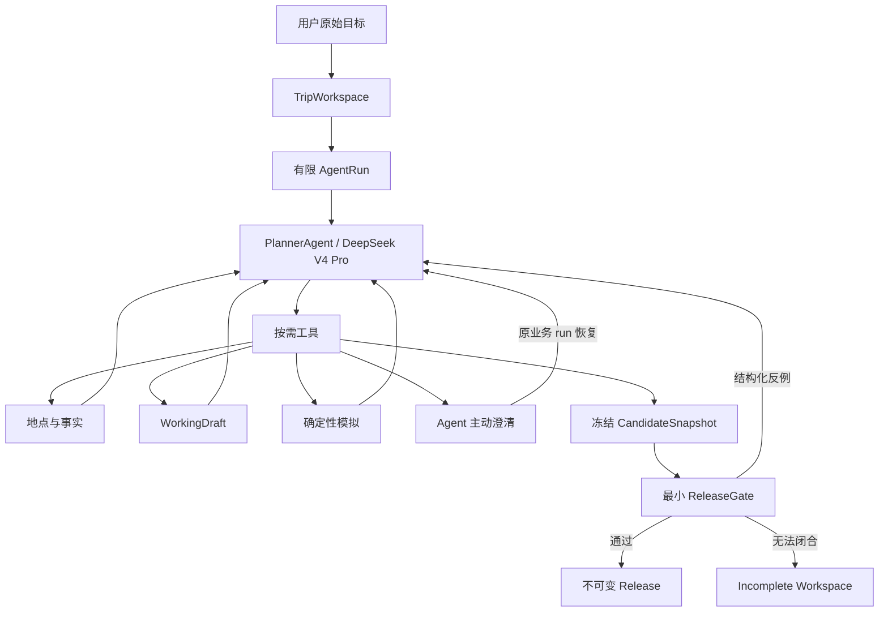
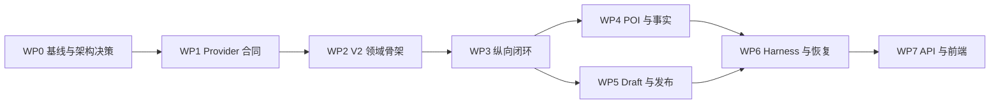

# Trajecta Agent V2：WP0～WP7 权威执行计划

> 状态：WP0～WP7 已完成；当前处于 WP8 验收
> 决策日期：2026-07-18
> 实施目录：`/Users/wk/Documents/产品设计/Agent开发`
> 范围：WP0～WP7；WP8 影子验收与 WP9 切流删除另行执行，但本计划产物必须为其提供可验证入口
> 优先级：本文件是 Agent V2 重构的实施基准；现有 `AGENT_REFACTOR_PLAN.md` 仅描述 Legacy 当前架构和历史重构，不得反向约束 V2
> 当前实现、预算与验收口径以 `docs/ARCHITECTURE.md` 和
> `docs/agent-v2/WP8_SYSTEMIC_REPAIR_2026-07-19.md` 为准；本文件中的初始性能目标保留为计划基线。

## 1. 目标与完成定义

本次目标不是在 Legacy 流程后面增加一个更自由的模型调用，而是重建产品控制面：用户提交原始旅行目标后立即创建长期 `TripWorkspace` 和一次有限生命周期的 `AgentRun`；唯一根 `PlannerAgent` 使用 DeepSeek V4 Pro，自主决定地点理解、候选搜索、事实补充、草案构建、模拟修正、澄清和提交的顺序。确定性 Python 只拥有外部事实、实体身份、坐标、路线、时间算术、状态一致性、幂等、资源预算和最小发布不变量。

WP0～WP7 完成必须同时满足：

- 原始输入不再经过“先识别 POI、用户确认、再开始规划”的强制前置流程。
- V2 不导入 Legacy 的 planner、workflow、POI 评分、normalizer、fallback 或 orchestration 决策代码。
- 根 Agent 的工具序列由当前状态和问题决定，不是 Python 固定阶段图。
- 不存在 deterministic itinerary fallback；系统不得用代码替模型完成地点取舍、分天和排序后伪装成 Agent 成功。
- 发布事实均可追溯到真实候选、来源或显式 Estimate；`spatial_estimate` 永远不能变为 `verified`。
- 只有系统事实不变量和用户明确标为不可调整的承诺可以阻止发布；模型推断和普通体验偏好只能形成优化目标。
- 运行必须有界、可持久化、可恢复；终态、Workspace mutation、用户答案和 Release 不能重复或被后续异常覆盖。
- 前端呈现连续协作体验，但运行中不接受用户主动修改；Agent 主动澄清沿用原业务 run，发布后修改创建 revision run。
- 技术绿灯、HTTP 200、`completed` 或一份看起来合理的行程都不能单独作为完成证据。

## 2. 已确认的不可回退决策

1. `TripWorkspace` 是当前旅行的长期协作记忆，`AgentRun` 是一次有限任务，`Release` 是不可变发布版本。
2. 生产链路只使用 DeepSeek V4 Pro 根 Agent 与 V4 Flash 轻量结构化调用；不引入其他生产模型供应商。
3. 轻量模型没有独立目标、长期记忆和 Workspace 写权限，不组成多 Agent 系统或固定流水线。
4. 首版不引入 LangGraph、业务阶段图、Code Mode、Dynamic Workflow、Subagents 或跨旅行自动记忆。
5. PydanticAI Core 负责 Agent loop、Toolsets、类型化消息和 Deferred Tools；Pydantic AI Harness 的 `StepPersistence` 只能作为候选 provider transcript/step store，是否采用由 WP1 真实合同决定。
6. Harness 数据结构不得进入领域 API。`StepPersistence` 不等价于业务状态 checkpoint，也不承诺副作用 exactly-once。
7. Provider transcript 是 opaque runtime state：不作为业务事实、不展示给用户，但 DeepSeek thinking 工具回合所需的 `reasoning_content` 必须完整保存和回传。
8. `incomplete` 是最小发布条件无法闭合时的诚实终态，不是常规预算出口；Agent 必须使用 anytime planning 尽早保留最近可行候选。
9. V2 隔离重写后先影子运行，再一次切流；Legacy 只能作为对照和运行级回滚，不能成为 V2 内部 fallback。

## 3. 目标边界



模型拥有：地点取舍、分天、排序、餐饮策略、草案修复、是否继续查证、何时澄清、候选提交。

确定性系统拥有：真实候选 ID、来源记录、坐标、地址、路线事实、日期与分钟算术、原子 mutation、版本、幂等、预算、恢复、发布门禁。

## 4. 总体依赖与 Gate



任何 WP 未达到退出门槛时不得把后续 WP 的骨架或示例当成进度替代。Gate 允许修正具体技术选型，但不允许回退上述产品与责任边界。

---

## WP0：冻结真实基线

### 目标

用可重跑证据冻结 Legacy 的技术、真实链路、产品质量和代码所有权，建立 V2 的回归数据入口。禁止继续引用历史测试数或旧供应商运行作为当前事实。

### 任务

1. 记录 Git 根、分支、commit、dirty state、Python/Node/pnpm 与依赖锁定状态。
2. 运行技术基线：

   ```bash
   backend/.venv/bin/pytest -q
   backend/.venv/bin/python -m compileall -q backend/app backend/main.py
   cd frontend && pnpm test
   cd frontend && ./node_modules/.bin/tsc --noEmit --incremental false
   cd frontend && pnpm exec next build --webpack
   ```

3. 运行当前真实供应商链路：

   ```bash
   backend/.venv/bin/python backend/scripts/live_acceptance_six.py --summary-only
   ```

   若仓库仍保留单场景脚本，也记录其结果，但不得用它替代六场景。
4. 每次真实运行至少记录：commit、模型名、prompt/协议版本、高德状态、技术终态、`fact_status`、`experience_status`、场景断言、耗时、模型/工具调用量、是否使用 Legacy fallback。
5. 在 `backend/evals/agent_v2/datasets/` 建立版本化数据集合同：

   ```text
   mention_cases.jsonl
   grounding_cases.jsonl
   fact_claim_cases.jsonl
   trip_cases.jsonl
   runtime_cases.jsonl
   ```

   首轮目标规模分别为 100、60、50、30、20 条。允许分批标注，但任何未完成规模必须在 WP0 报告中明确，不得用空壳数据集宣称 Gate 通过。
6. 建立 ADR：

   ```text
   docs/agent-v2/ADR-001-agent-control-boundary.md
   docs/agent-v2/ADR-002-workspace-run-release.md
   docs/agent-v2/ADR-003-minimal-hard-constraints.md
   docs/agent-v2/ADR-004-deepseek-and-pydanticai.md
   docs/agent-v2/ADR-005-local-runtime-temporal-ready.md
   docs/agent-v2/LEGACY_BASELINE.md
   docs/agent-v2/LEGACY_OWNERSHIP.md
   ```

7. Legacy 所有权表逐文件标记：必须删除的规划决策、可迁移纯计算、可复用外部 adapter、历史只读 adapter、临时 API facade。
8. 为每个历史产品失败建立稳定 case ID，至少覆盖：跨天顺序、酒店锚点、固定预约、闭馆、同名/父子 POI、长距离转场、事实降级、恢复与 stale publish。

### 退出门槛

- 所有本地技术基线命令都有本轮实际结果。
- 六场景真实链路重新运行，或明确记录不可运行的外部原因与替代证据；不得沿用历史结果冒充当前结果。
- 每个已知关键失败均有稳定 case ID 和预期断言。
- ADR 与 Legacy 所有权表完成审阅。
- 数据集的实际条数、来源和未标注缺口明确。

---

## WP1：DeepSeek V4 Pro 与 PydanticAI 合同验证

### 目标

在建设完整运行时之前，证明 DeepSeek V4 Pro thinking 工具调用、PydanticAI 消息表达、持久化快照和 Deferred Tools 能形成可恢复合同。

### 当前已知事实

- 仓库当前锁定 `pydantic-ai-slim[openai,retries]==2.10.0`，未安装 `pydantic-ai-harness`。
- 当前 production adapter 默认 planning model 为 `deepseek-v4-flash`，并关闭 thinking。
- DeepSeek V4 thinking 工具回合要求后续请求保留 `reasoning_content`；官方 Agent 集成还要求 thinking 时不发送 `tool_choice`，并要求 assistant tool-call message 的 `content` 非空。
- Harness `StepPersistence` 只保存 step events、provider-valid snapshots 和 tool-effect ledger；Workspace checkpoint、副作用去重和业务恢复仍由 Trajecta 负责。

### 新增内容

```text
backend/tests/contracts/test_deepseek_v4_tools.py
backend/tests/contracts/test_deepseek_v4_resume.py
backend/tests/contracts/test_pydantic_step_persistence.py
backend/scripts/run_deepseek_v4_contracts.py
backend/app/trip_agent/adapters/provider.py
backend/app/trip_agent/runtime/persistence_port.py
```

### 合同矩阵

1. Thinking 下单工具调用。
2. 连续 3～5 轮不同工具调用。
3. 同轮多个只读工具调用。
4. 无效 JSON 参数、未知字段、幻觉工具名。
5. 结构化 `submit_candidate` 输出工具。
6. 工具返回后继续决策。
7. `finish_reason=length`、`content_filter`、`insufficient_system_resource`。
8. 429、5xx、连接超时和读取超时。
9. 工具回合 `reasoning_content`、assistant `content`、tool-call ID 保存与回传。
10. 从 provider-valid snapshot 跨进程继续。
11. Deferred Tool 暂停、持久化、带原 message history 和 `DeferredToolResults` 继续。
12. 超长工具结果的截断、引用化与再次读取。
13. 不传 `tool_choice` 时的自主工具选择。
14. 多个 PydanticAI/Harness 精确版本组合的兼容性。

### 技术决策规则

- 根模型目标为 `deepseek-v4-pro`；V4 Flash 只用于受限结构化工具。
- 默认尝试 `thinking=enabled`、`reasoning_effort=high`；若真实合同失败，只能停在 WP1 定位，不得静默切换生产语义。
- thinking 请求不发送 `tool_choice`、temperature、top_p、presence/frequency penalty。
- 工具 schema 先使用 `strict=False`，参数必须经过 Pydantic 二次验证；Beta strict 只能作为独立实验。
- Provider transcript 与领域状态分库存储、分保留策略。
- PydanticAI 与 Harness 必须精确锁版本；Harness 通过 `AgentPersistencePort` 隔离。
- 不得退回字符串首尾 `{}` 截取、旧 `PlannerTurn` 或 deterministic blueprint。

### 真实 canary 门槛

- 至少 30 次真实多工具运行。
- 因 thinking、message replay 或 `tool_choice` 引发的 400 为 0。
- 未处理解析异常为 0。
- 无效参数全部在工具执行前拒绝并可反馈模型修正。
- 从安全 snapshot 恢复后可继续工具调用。
- 同一个 tool call 不产生重复 Workspace mutation。

### 失败处理

WP1 不通过时停止进入 WP2。允许比较 non-thinking 仅用于定位，不得作为未声明的生产降级；优先修正 provider profile、message serialization、PydanticAI/Harness 版本和工具 schema。

---

## WP2：建立隔离的 V2 领域与持久化骨架

### 目标

建立不依赖 Legacy 决策模块的严格领域合同、仓储接口和最小持久化。此阶段不追求完整 event sourcing。

### 目录

```text
backend/app/trip_agent/
  domain/
    goal.py
    claims.py
    places.py
    workspace.py
    draft.py
    run.py
    candidate.py
    release.py
  agent/
    planner.py
    instructions.py
    context.py
    outputs.py
  toolsets/
  runtime/
  repositories/
  adapters/
  validation/
  api/

backend/tests/trip_agent/
  architecture/
  domain/
  tools/
  runtime/
  integration/
  fault_injection/
```

### Import 隔离

`backend/app/trip_agent/` 禁止导入：

```text
app.agents.planning_workflow
app.agents.planner
app.agents.intent_ledger
app.agents.poi_extractor
app.agents.schedule_evaluator
app.agents.itinerary_normalizer
app.services.poi_grounder
app.orchestration.planning_orchestrator
```

允许经 V2 adapter 复用：`AmapClient`、Web search client、HTTP 错误分类、纯距离/时间计算、无业务决策缓存、历史只读行程读取。

### 领域对象

- `RunGoal`、`GoalCommitment`、`GoalLedger`
- `ObservedClaim`、`DerivedClaim`、`Estimate`、`DecisionClaim`、`UserCommitmentClaim`
- `SourceRecord`
- `PlaceHypothesis`、`PlaceCandidate`、`PlaceResolution`
- `TripWorkspace`、`DraftSnapshot`、`CandidateSnapshot`
- `ClarificationBatch`、`AgentRun`、`ReleaseRecord`

领域模型默认使用严格、冻结 Pydantic 配置：`ConfigDict(extra="forbid", frozen=True)`。需要 mutation 时创建新版本，不原地篡改已发布或已冻结对象。

### 最小存储

```text
trip_workspaces
workspace_snapshots
agent_runs
agent_interruptions
agent_releases
```

`source_records` 和 `knowledge_claims` 在 WP4 根据实际查询模式拆表。Provider messages、step events、continuable snapshots 与 tool effects 进入隔离 store。

### 状态与并发语义

- Run 状态：`created/running/waiting_user/validating/published/incomplete/failed/cancelled`。
- 所有终态不可覆盖。
- Workspace 版本单调递增。
- stale `expected_version` mutation 被拒绝。
- 相同 idempotency key 只创建一个业务 run。
- 澄清答案按 tool-call ID 只消费一次。
- 相同 release key 只发布一次。
- Provider transcript 不进入 Workspace JSON 或用户 API。

### 退出门槛

- 无模型参与时可创建、持久化并重载 Workspace、Run、Snapshot、Interruption 和 Release。
- V2 import graph 与 Legacy 决策代码完全隔离并有自动测试。
- 数据库进程重启后状态一致。
- 终态、版本、幂等、答案和发布不变量均有回归测试。

---

## WP3：完成第一条 AI-Native 纵向闭环

### 目标

尽早证明根 Agent 真正拥有行动顺序：从原始文本直接到草案、模拟、修正和候选提交，而不是先建平台再在末期验证模型。

### 最小工具集

```text
read_workspace
analyze_place_mentions
search_place_candidates
resolve_place
apply_draft_change
simulate_candidate
request_clarification
submit_candidate
```

地图和事实初期允许使用受控 fixture 与少量真实 adapter，但 V2 不得调用 Legacy planner、grounder 决策或 fallback。

### 运行闭环

```text
原始输入
→ 创建 TripWorkspace 与 AgentRun
→ V4 Pro 自主调用工具
→ 写入 GoalLedger
→ 建立 PlaceHypothesis
→ 搜索并 resolve 候选
→ 前半预算内创建最小可行草案
→ 确定性模拟返回反例
→ Agent 查询、移动、替换、删除或澄清
→ 冻结 CandidateSnapshot
→ 最小 ReleaseGate
→ published / incomplete
```

### 要求

- 不调用 `/recognize-places` 作为前置步骤。
- 不预设工具顺序或固定辅助模型流水线。
- 不存在 deterministic blueprint、外层候选评分和 normalizer 自动修路。
- 始终保存最近一个通过结构模拟的 Agent 候选。
- Prompt 只注入目标、草案、blocker、预算和最近行动摘要；详细数据通过 `read_workspace` 获取。
- 建立最小 ObservationStream，开发页可见行动摘要、草案变化和事实缺口，不展示 chain-of-thought。

### 首批场景

1. 单日明确地点。
2. 多日含酒店。
3. 一个歧义地点。
4. 一个已知闭馆地点。
5. 一个固定不可调整预约。
6. 明确硬约束冲突导致 `incomplete`。

### 退出门槛

- 六个场景均由原始文本进入正确终态。
- deterministic fallback 为 0。
- 工具轨迹与场景状态相关，不是固定模板。
- Agent 能根据模拟反例自主查询、重排、删除、替换或澄清。
- 至少一个场景完成原业务 run 的暂停与恢复。

---

## WP4：重写 POI、来源和事实体系

### 目标

把实体识别、候选、来源、事实、估计和 Agent 决策彻底分层，消除父子 POI 替换、类别覆盖身份、无来源 verified 和空间估算冒充地图事实。

### 地点提及

V4 Flash `MentionExtractor` 输出 mention ID、原始字符区间、原始名称、上下文、可能类别、品牌/分店/区域/活动属性和置信度。确定性代码只校验字符区间、schema 与完全重复，不用别名、长度或动作正则做语义决策。

### 候选搜索与解析

- 每个 mention 最多生成三个查询，支持分页。
- 原始高德/Web 响应完整保存为 `SourceRecord`，进入 Agent 的是必要字段投影。
- 保留 parent/child hierarchy、raw query、city/qualifier、坐标来源和 provider ID。
- 不固定只取前五个，不允许类别分数覆盖实体身份。
- V4 Flash 可给候选比较、匹配证据、歧义理由和继续搜索建议；只有根 Agent 可调用 `resolve_place`。
- 可靠身份、坐标可用性与偏好动作分开建模；证据不足返回 `ambiguous`，不能静默替换父实体为子实体。

### Claim 模型

所有 claim 携带实体与字段、适用日期/时间/地点、来源片段引用、抽取器及版本、获取时间、有效期、置信等级、冲突 claim IDs 和 ReleaseGate 使用资格。

- `ObservedClaim`：来源直接支持。
- `DerivedClaim`：确定性算法从已知事实推导。
- `Estimate`：模型或空间估算。
- `DecisionClaim`：PlannerAgent 取舍。
- `UserCommitmentClaim`：用户明确要求及原文证据。

没有 `SourceRecord` 不得生成 `ObservedClaim`。

### 地点与路线事实

- `acquire_place_facts` 支持营业时间、闭馆日期、停止入场、预约要求和日期有效性。
- `acquire_route_facts` 只接受已 resolve 的候选 ID，支持批量 pair；缓存键包含方向、方式、时间范围和来源版本。
- 高德失败时允许 `spatial_estimate`，但类型只能是 `Estimate`，事实状态不得为 `verified`。

### 游览画像

V4 Flash 输出最短/推荐/延长停留、推荐时段、置信度和理由。程序只校验数值范围、粒度和一天物理上限，不用固定语义 fallback 替代模型画像。

### 数据集门槛

- Mention recall ≥ 95%。
- 自动确认地点 precision ≥ 98%。
- 歧义地点错误自动确认率 ≤ 1%。
- 已确认地点引用真实候选 ID 为 100%。
- 无来源事实进入 verified 为 0。

---

## WP5：WorkingDraft、确定性模拟器和最小 ReleaseGate

### 目标

让 Agent 通过高语义 mutation 管理草案；让确定性系统只计算、验证和返回反例，不暗中修路线。

### 高语义 Draft 操作

```text
allocate_day
reorder_cluster
protect_anchor
set_visit_window
set_meal_strategy
reduce_intensity
replace_place
remove_optional_place
```

一次 `apply_draft_change` 可包含多个操作，全部基于 `expected_version` 原子执行；任一非法则整体回滚。返回新版本和变化摘要，不自动补齐模型未做的体验决策。低层 `move_place/set_duration` 仅作为内部原子实现。

### 确定性模拟器

计算日期/时间、停留、路线、酒店出发返回、固定预约、营业窗口、用餐占用、每日总外出、空档和物理冲突。模拟器只返回 `SimulationReport` 和结构化反例，不修改 Draft。

### 最小 ReleaseGate

仅以下内容阻断发布：

- 虚构或未知实体引用。
- 坐标、地址、路线或营业事实所有权违规。
- 日期越界、时间倒序或物理重叠。
- 明确闭馆仍安排。
- 用户有原文证据且明确不可调整的承诺未满足。
- stale Workspace/fact/candidate version。
- `spatial_estimate` 被错误提升为 verified。

每天地点数、普通饭点、酒店往返偏好、强度、跨区、推荐时段、日间均衡、普通必去、餐饮购物比例等默认进入体验优化与 `experience_status`，不阻断发布。

### 候选提交

```python
SubmitCandidate(
    candidate_id=...,
    workspace_version=...,
    fact_version=...,
    completion_reason=...,
)
```

验证失败冻结 `CandidateRejected` 并一次返回全部结构化反例；最多提交三次，不自动 repair。

### 文案

只在 ReleaseGate 后生成；只能修改说明字段，不能调整地点、时间、交通与事实。发布前再次核对事实指纹；文案失败使用确定性展示模板，但不得改变路线和状态。

### 退出门槛

- 同一 Draft 重复模拟结果一致。
- 模拟器与验证器不产生 mutation。
- false verified 为 0，`spatial_estimate → verified` 为 0。
- 文案事实漂移为 0。
- 体验偏差不会误变成系统失败或发布阻断。

---

## WP6：Trajecta Domain Harness 与 Durable Local Runtime

### 目标

建立有界、自主、可恢复的领域 Harness；PydanticAI/Harness 只提供 provider loop 与安全消息边界，Trajecta 自己拥有业务状态、预算、进展、幂等和发布。

### ContextBuilder

每轮只注入稳定系统规则、原始目标摘要、有来源的 commitment、当前草案摘要、前五个重要 blocker、事实覆盖、预算和最近 provider-valid 行动。完整候选、网页、路线矩阵和历史版本按需读取。

### Anytime BudgetController

- 排除等待用户后绝对执行上限 8 分钟。
- 前约 70% 用于搜索、事实和草案优化；后约 30% 保留给模拟、blocker 修复与提交。
- 同签名工具最多重复两次。
- 连续两次无有效进展告警；连续三次停止扩展动作。
- 单次运行最多五个用户问题。
- 临近预算上限时依次停止候选扩展、低价值体验评审和重复搜索，读取最近可行草案，只解决发布 blocker，然后提交或进入明确 `incomplete`。

### ProgressMonitor

至少衡量 blocker 是否减少、必要事实覆盖是否增加、模拟可行性是否改善、草案质量、决定反复次数、工具调用 information gain；不能用“数据库有变化”冒充有效进展。

### RetryPolicy

- Provider 网络错误最多一次 runtime retry。
- 外部工具临时错误按分类最多两次。
- Schema 错误最多两次反馈模型修正。
- `invalid_request/not_found/证据不足` 不做网络重试。
- 不叠加 HTTP、provider、业务循环和未来 Temporal 的多层重试。

### IdempotencyManager

- 地图、网页、模型读取允许重放，优先复用已保存响应。
- Workspace mutation 使用事务与 idempotency key 单次生效。
- 用户答案按 tool-call ID 唯一消费。
- Release 使用唯一 release key 与事务边界。
- 外部不可幂等写操作在首阶段禁止或要求人工审批。

### 同 run 澄清

- `request_clarification` 一次持久化 1～5 题。
- 原业务 `AgentRun` 进入 `waiting_user`。
- Provider 的一次 `.run()`/snapshot 身份与业务 run ID 分离，但通过 conversation/lineage 映射回同一业务 run。
- 答案与原 message history、`DeferredToolResults` 一起继续；答案只应用一次。
- 运行期间不开放主动用户修改；发布后新要求创建 revision run。

### 故障注入

在模型请求前后、工具 started/completed 之间、Workspace transaction 前后、Clarification 保存前后、Answer 消费前后、Candidate 冻结前后和 Release 保存前后终止进程。

### 退出门槛

- 进程重启后从最近 provider-valid snapshot 继续。
- Workspace mutation、用户答案和 Release 均无重复。
- `unknown_after_crash` 工具副作用被显式识别并按工具类型恢复。
- 所有终态不可覆盖。
- 预算耗尽导致 `incomplete` 的评测比例低于 2%。

---

## WP7：替换 API 与前端产品流程

### 目标

把产品入口从 Legacy wizard 替换为 Workspace/Run 协作模型，并让刷新、暂停、回答、恢复、发布和 revision 在浏览器链路中一致。

### 后端 API

```text
POST /trip-workspaces
GET  /trip-workspaces/{workspace_id}
POST /trip-workspaces/{workspace_id}/runs
GET  /agent-runs/{run_id}
GET  /agent-runs/{run_id}/events
POST /agent-runs/{run_id}/answers
POST /agent-runs/{run_id}/resume
POST /agent-runs/{run_id}/cancel
POST /trip-workspaces/{workspace_id}/revisions
```

### 前端模块

```text
frontend/components/agent-v2/AgentRunPanel.tsx
frontend/components/agent-v2/AgentProgressStream.tsx
frontend/components/agent-v2/WorkspacePanel.tsx
frontend/components/agent-v2/PlaceHypothesisList.tsx
frontend/components/agent-v2/ClarificationBatchCard.tsx
frontend/components/agent-v2/ReleaseStatusCard.tsx
frontend/components/agent-v2/ReleaseHistory.tsx
```

### 用户流程

1. 用户提交原始旅行目标。
2. 立即创建 Workspace 和 Run，3 秒内显示首个进度事件。
3. 展示 Agent 当前解决的问题、已完成事项、草案和事实缺口，不展示 reasoning。
4. 运行中输入框禁用；只有 `waiting_user` 可回答 1～5 题及“其他”。
5. 回答继续原业务 run，刷新和进程重启不丢状态。
6. 发布后恢复修改入口；修改创建 revision run，不改写旧 Release。
7. Legacy 已发布行程通过只读 adapter 展示；旧未完成运行不迁移。

### 退出门槛

- 原始输入不再依赖 `/recognize-places → /plan` 前置流程。
- 页面刷新后可恢复运行、问题和发布状态。
- 重复答案不重复执行，revision 不改写旧 Release。
- 前端不展示 `reasoning_content` 或 chain-of-thought。
- 后端、前端测试、TypeScript 与 production build 通过。
- 通过 `localhost:3000/api/backend/...` 实际验证浏览器代理链路，不以 FastAPI 根路径 404 误判服务失败。

---

## 5. 统一验收与交付格式

每个 WP 完成时必须记录：

- 实际完成的行为和修改文件。
- 新增或变更的领域合同。
- 实际运行的测试、真实链路和结果。
- 未执行的外部验证及原因。
- 新发现风险和剩余缺口。
- Gate 是否通过、是否允许进入下一 WP。

性能目标：首个进度事件 ≤ 3 秒，普通规划 p50 ≤ 2 分钟、p95 ≤ 5 分钟，排除等待用户后的绝对执行时间 ≤ 8 分钟。产品目标：因预算耗尽进入 `incomplete` < 2%，总 `incomplete` < 5%，deterministic itinerary fallback 恒为 0。

## 6. 删除 Legacy 的时点（WP8/WP9 前置约定）

WP7 不直接删除仍承担正式流量的 Legacy。删除发生在 V2 完成影子验收、停止创建 Legacy run、现有 Legacy run 终结、V2 默认运行至少 7 天并覆盖一个正式发布周期、无 P0/P1 回滚事件且至少 30 次真实全链仍满足 Gate 后。

届时删除旧 planner/workflow、POI 评分与类别覆盖、语义 duration fallback、schedule evaluator、normalizer 自动修补、旧 orchestrator、deterministic blueprint/candidate scoring、旧 POI 确认前置 API、单问题 intervention 和前端旧恢复协议。只保留经等价测试的外部 adapter/纯计算、最终展示组件和历史行程只读 adapter；历史 adapter 在数据保留周期结束后单独删除。

## 7. 当前执行起点

从 WP0 开始：先重新运行技术与六场景真实基线，建立 ADR、数据集合同和 Legacy 所有权表。WP1 provider 合同通过之前，不创建完整 V2 runtime；WP3 纵向闭环通过之前，不扩建完整平台能力。
