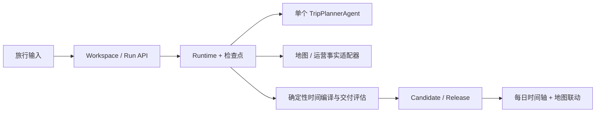

# Trajecta 当前架构

当前生产代码为 V3 单栈。完整领域不变量、状态机、数据流、事实所有权和交付门禁见
[`agent-v3/ARCHITECTURE.md`](./agent-v3/ARCHITECTURE.md)。

2026-10-02 调整为交付优先的旅行工作台。模型负责地点取舍与草案；Runtime 管理有上限的
执行与检查点；普通 Python 编译时间、核验事实并决定交付；前端将同一 Candidate 展示为
地图与时间轴。零阻断问题允许完成交付；普通运营资料缺失保留 degraded 事实状态，体验建议独立记录。

具体取舍、调用预算、错误处理与本次验证证据见
[`agent-v3/REDESIGN_2026-10-02.md`](./agent-v3/REDESIGN_2026-10-02.md)。

根前端 `/` 使用 `AgentV3WorkspaceApp`；后端只挂载 `/api/v3` 与 `/health`。V1/V2 代码、
路由、测试和前端已经删除。切流范围、外部证据限制与回滚语义见
[`agent-v3/MIGRATION_AND_CUTOVER.md`](./agent-v3/MIGRATION_AND_CUTOVER.md)。
