# Trajecta Agent V3：以真实交付为中心的隔离重建

## 1. 核心判断

V3 的完成条件是：当前运行针对当前用户目标，形成一份显式需求全部闭环、地点身份可解释、逐段时间可执行、关键事实可追溯且通过交付评估的旅行方案。

当前系统为 V3 单栈：根前端 `/` 使用 V3，后端只挂载 `/api/v3`。DeepSeek provider、provider
coordinator、高德 client 和 Web search adapter 均位于 V3 内部；架构测试禁止 V3 导入任何
V1/V2 包。

## 2. 不变量

1. 原始资料不能直接进入地图查询。地图查询只能消费 `QueryPlan.targets`。
2. 每个地点 obligation 必须带精确原文 span；稳定 ID 由 Python 根据 span 和角色生成。
3. 时间词、行动词、分天词、节奏词和交通偏好不是 POI。它们进入结构化 constraint；反过来，
   显式可排程地点不得标成 `reference` 或 `not_a_place` 绕过查询。
4. 每个查询目标最多保留 3 个候选；入口、地铁站和附属设施在进入 Agent 上下文前过滤。
5. 每个原始地点都有一条 `GroundingDecisionView`，包含最终选择、理由、置信度和仍需确认的候选。
6. 每个显式地点最终只能是 `scheduled`、`pending_confirmation`、`not_scheduled` 或 `excluded`，且非安排状态必须有原因。
7. 已安排的指定餐厅必须是带已选 `candidate_id` 的 `meal` stop；未安排的普通地点必须保留具体取舍原因与建议。
8. 每天必须有标题，并以可见酒店或机场 anchor 开始和结束。
9. Agent 只决定地点取舍、分天、顺序和停留时长；路线事实与全部时间算术由 Runtime 编译。
10. 事实请求只能由已提交草案的 stop 和相邻 leg 派生。先查询路线并编译真实到达时间，再只对计划内非锚点停靠查询该到访时刻的运营事实。
11. `spatial_estimate` 永远不能成为 verified 路线事实。
12. 运营信息采用高德地点详情或检索返回的来源，保存 URI、摘要、内容哈希、检索时间及 claim 引用。常规周期营业时间直接适用，无须精确日期公告或多来源重复确认。提取器的置信度数值不决定来源事实的采用。
13. 普通营业资料缺失或提取服务失败允许交付，内部 `fact_status=degraded` 保留资料完整性。明确的闭馆、营业时段冲突、地点身份错误和固定预约冲突要求 Agent 调整。空间估算路线继续保留 `estimated` 并等待真实路线。具体体验建议保存在 Candidate 与 Assessment。
14. Release 必须绑定 `producing_run_id`；读取当前运行时禁止回退到工作区最新 Release。
15. 取消、失败和成功是不可覆盖终态；等待用户、需要恢复和发布具有独立且一致的语义。
16. Grounding 一旦完成就不可在同一 goal revision 中重新打开；候选选择、规划、事实与交付
    只能沿单向状态推进。Agent 方案不满足领域契约时返回软反馈，不覆盖已落盘业务状态。
17. 普通时间、分天、交通、节奏及地点偏差按具体 issue 的 `severity=review` 评估。
    `strength=required` 本身没有发布阻断资格。时间或分天约束只有 `fixed_commitment=true`
    且原文证据支持已确认预约或不可调整时才可能产生 `blocking`；遗漏该预约同样阻断。
    步行单段上限独立保存，允许正常驾车路线。

## 3. 数据流

```mermaid
flowchart LR
    A["SourceDocument<br/>原始资料与修订"] --> B["RequirementProposal<br/>受限结构化理解"]
    B --> C["RequirementLedger<br/>地点 obligation + 非地点约束"]
    C --> D["QueryPlan<br/>唯一地图查询白名单"]
    D --> E["CandidateSet<br/>每组最多 3 个"]
    E --> F["GroundingRegistry<br/>选择理由或澄清"]
    F --> G["WorkingDraft<br/>酒店/机场 + 真实 Stop"]
    G --> H["Route FactNeedPlan<br/>仅计划内相邻 Leg"]
    H --> I["CompiledTimeline<br/>真实到达时间"]
    I --> O["Operational FactNeedPlan<br/>仅计划内真实停靠"]
    O --> J["CandidateSnapshot<br/>覆盖、消歧、来源事实、体验"]
    J --> K{"DeliveryAssessment"}
    K -->|"Agent 调整"| G
    K -->|"Agent 明确发布 + 真实路线 + 无执行冲突"| L["Run-bound Release"]
    L --> N["关闭工具写入"]
    K -->|"明确执行冲突"| M["Agent 调整行程"]
```

发布顺序固定为：

`WorkingDraft → RouteFactNeedPlan → CompiledTimeline → OperationalFactNeedPlan → CandidateSnapshot → DeliveryAssessment → Release`

可视化数据由 `assembly.py` 在时间线编译后补齐：`TimelineStop.location/address` 只取已选择的
高德候选。原始 GCJ-02 坐标保留；浏览器显示层转换为 WGS84 后叠加 OpenStreetMap 底图。
地图连线表示访问顺序，逐段交通时长继续读取独立路线事实。

说明文案只能读取已通过门禁的不可变事实，不得修改 stop、leg、时间或处置结果。当前 V3 使用
确定性 `ReleaseNarrative` 将地点名、到达时间、停留和逐段交通转成可读摘要，避免在发布后再引入
模型漂移或泛化风险模板。

## 4. 单根 Agent 与受控 Runtime

生产语义只有一个根 `TripPlannerAgent`。资料理解可以使用受限结构化调用，但它不是第二个领域 Agent。

根 Agent 通过局部工具自主决定下一步：

- `list_grounding_targets`
- `read_grounding_target`
- `submit_grounding_decision`
- `submit_grounding_decisions`：整批预校验后提交，最多 20 项
- `finalize_grounding`
- `read_planning_context`
- `submit_plan`
- `assess_candidate`：编译事实、形成候选和评估，保留调整机会
- `finalize_candidate`：明确发布评估后的候选，结束本轮执行
- `request_clarification`

Runtime 不规定 Agent 必须按固定业务脚本调用工具，但强制所有写入满足领域不变量。Grounding 工具一次只暴露一个候选组；Planning 工具按 obligation page 和 active day 返回局部视图。全量资料、全量候选、旧草案和旧门禁结果不进入每轮上下文。

默认规划模型使用 DeepSeek Flash。每次执行最多 24 次根模型请求、80 次工具调用，预算覆盖
最多 6 个压缩上下文回合，接近上限时预留提交与评估机会。默认墙钟上限为 300 秒。
暂停后保留检查点；用户继续同一业务 Run 时开始一轮新执行，累计指标持续记录。
同一地点的并行读取合并实际查询，写工具串行执行；余额、认证和额度错误分类暂停，普通工具
输入错误返回有上限的修正反馈；最近一次反馈随 checkpoint 保存，并进入续跑上下文，
成功提交后清除。短途交通和重复酒店节点由根 Agent 根据真实路线事实优化。
交通使用结构化 `mode_policy`：`prefer` 是根 Agent 的优化目标，`only` 表示用户明确限定方式。
`max_walk_minutes` 独立核算；`strength` 与方式排他性分别表达。交通解释由受限资料理解调用完成。
候选先评估，再由 Agent 调整或明确发布。`RunLifecycleToolset` 统一关闭已结束执行的所有工具；
根执行循环在发布后停止，并补齐末次工具响应。交付接口使用 Release 绑定的候选。成功状态与 Release 由 Repository 在同一事务中提交。

Runtime 在候选组、消歧决定和草案写入后保存业务 checkpoint。完成 Grounding 或一次不可发布 Candidate 后，provider transcript 切换为紧凑业务状态和具体反馈。相同输入恢复时复用已收敛的地点和成功事实，失败事实重新查询。Grounding 完成后，Agent 继续规划和修复。计划提交违反 Ledger／Grounding 时返回 `ModelRetry`。未闭环运行转为 `needs_resume`。

`waiting_user` 只用于用户掌握的住宿、航班、私人预约信息和意图地点选择。营业时间、闭馆、停止入场、公开预约规则和路线事实由工具查询。已有高德营业资料时复用这些数据；其余地点在一次执行内最多进行两次搜索和两页正文读取。工具接受现有来源中的周期营业资料，缺少完整时段的来源信息以 `visit_compatible=null` 保存。普通资料缺口经 `fact_policy.py` 允许交付；明确冲突进入 Agent 调整。地点澄清问题由候选名称、地址及意图选择生成。

最终产品页展示地图、时间轴、地点信息和有来源的预约事项。Assessment、FactGap、provider 错误与工具轨迹用于内部处理。页面展示由行程和运营 claims 生成，内部诊断模块已移除。

回答继续使用同一业务 `run_id`。草案编号包含输入指纹，候选编号包含本次事实结果；新输入与补查事实各自形成独立快照。API 只返回当前未回答的问题，执行中的交付状态为 `working`。发布后读取 Release 绑定的候选与评估。

## 5. 状态语义

运行状态：

- `created`：已受理，尚未执行；
- `active`：根 Agent 正在行动；
- `waiting_user`：具体地点歧义会改变路线；
- `needs_resume`：有可恢复进度，但目标未闭环；外部 provider 余额、限流或临时不可用也以
  `provider_blocked` 事件安全暂停；
- `succeeded`：当前运行已通过严格门禁并形成 run-bound Release；
- `failed`：运行失败且没有伪造交付；
- `cancelled`：用户取消，终态不可覆盖。

交付状态：

- `working`：没有候选交付物；
- `publishable`：严格门禁通过；
- `review_required`：路线仍为空间估算；
- `blocked`：存在未处置地点、歧义、路线缺口、明确营业冲突或固定预约 blocker；
- `not_delivered`：终态运行没有交付物。

运行与交付状态分别保存，前端按状态展示旅行进度与行程。内部状态名称与诊断详情留在处理记录。

## 6. 主要实现位置

- `backend/app/trip_agent_v3/domain/requirements.py`：地点 obligation、覆盖与时间／分天约束；
- `backend/app/trip_agent_v3/requirements.py`：span 校验、稳定 ID 与 Query Plan；
- `backend/app/trip_agent_v3/candidates.py`：候选过滤和硬上限；
- `backend/app/trip_agent_v3/domain/grounding.py`：按原始地点分组的消歧注册表；
- `backend/app/trip_agent_v3/commitments.py`：草案与显式需求闭环；
- `backend/app/trip_agent_v3/fact_needs.py`：计划后按需事实查询；
- `backend/app/trip_agent_v3/adapters/operational_facts.py`：计划到访时刻的有来源运营事实；
- `backend/app/trip_agent_v3/timeline.py`：确定性 Stop/Leg 时间编译；
- `backend/app/trip_agent_v3/experience.py`：对编译后真实到达时间回验资料约束；
- `backend/app/trip_agent_v3/autonomous_runtime.py`：单根 Agent 的受控状态与局部工具；
- `backend/app/trip_agent_v3/delivery.py`：严格交付门禁与 run-bound Release；
- `backend/app/trip_agent_v3/repository.py`：V3 独立 SQLite 状态；
- `frontend/components/agent-v3/DeliveryPanel.tsx`：每日时间轴、联动地图、地点信息和有来源的预约提醒。

## 7. 当前边界

V3 已于 2026-08-01 替换根入口，V1/V2 已删除。真实 provider 分布只启动 16/30，剩余 14 条由
用户明确终止；这项切流决策不把未执行外部验收改写为通过。详情见
`MIGRATION_AND_CUTOVER.md`。
