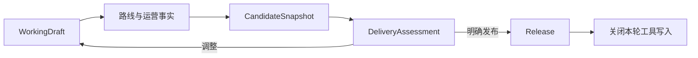

# 交通语义与发布生命周期改造

交通问题来自“路线偏好”与“限定方式”共用同一判断。发布问题来自评估和发布合在一次工具调用中，模型在收到体验反馈后继续写入已经发布的运行。此次删除交通条件句匹配逻辑，把两类问题落实到领域契约和执行生命周期。

`TransportPreferenceProposal`、`TransportPreferenceRequirement` 与规划上下文现在共同使用 `mode_policy`。`prefer` 提供优化目标，Agent 比较真实路线后选择合适方式。`only` 表达用户明确限定的方式，评估会记录方式偏差。步行时长上限独立核算，用户要求的强度独立保存。资料理解调用输出这些字段，确定性代码校验字段和时间；交通判断适用于全部地点与城市。

候选先由 `assess_candidate` 完成路线、时间线、运营事实与交付评估。Agent 可以读取反馈、修改草案，再决定调用 `finalize_candidate` 发布。普通体验建议保留调整与交付空间。确认预约与事实不变量继续参与发布资格判断。

`RunLifecycleToolset` 在统一入口处理已结束执行，覆盖同一模型响应中排队的工具。根循环在发布后停止请求，并保存最后一组工具响应。重复发布复用现有结果，交付接口读取 Release 绑定的候选。运行成功状态与 Release 在同一数据库事务提交，写入中断时回滚。
这些规则共同保护发布版本与调用额度。

后端 206 项检查通过。交通矩阵覆盖 40 组偏好／限定、要求强度、交通方式和步行时长组合。生命周期检查覆盖评估后修订、同批工具、结束状态、调用记录配对、交付版本和发布中断回滚。
最终原子发布还复用了真实行程的 14 项事实做生产 Runtime 回放，成功保存一致版本，模型调用为 0。前端 13 项检查、类型检查与生产构建通过。

新流程的上海真实联调先评估原草案，再修订第二天，最后发布。第二天从 6 小时 46 分钟缩短到 5 小时 48 分钟；保留酒店午餐与休息、思南公馆、田子坊和光明邨晚餐。所有步行段在 25 分钟以内，晚餐为 17:14–18:14，完整位于营业时段内。最终 `verified / good / publishable`，评估没有提醒项。根规划 6 次、运营提炼 6 次调用，耗时 82.1 秒，14 次事实缓存命中，地点查询复用已有结果。

成都、杭州和上海的原始真实时间线按新交通规则回放，交通偏好误报均为 0。成都保留晚餐相对时间偏好提前 4 分钟的提醒；杭州满足 7 小时节奏；上海最终满足 6 小时节奏。两次真实资料理解调用分别正确区分普通交通偏好与全程限定方式。

桌面页面保留地图、日期和时间轴，调整表单放入抽屉。依据区块、过程说明、重复标题与普通建议的操作性说明已移除。最终 831px 电脑视口没有横向溢出，地图与时间轴联动可用，浏览器没有 error / warn。DeepSeek 最后读到余额为 0.58 CNY。

## 证据

[最终上海运行](./evidence/2026-10-02-round2/round2-sh-two-day-systemic-report.json)、[最终交付](./evidence/2026-10-02-round2/round2-sh-two-day-systemic-delivery.json)、[三城市回放](./evidence/2026-10-02-round2/systemic-replay.json)、[真实交通语义提炼](./evidence/2026-10-02-round2/transport-policy-live-interpretation.json)、[调用配对与发布后写入检查](./evidence/2026-10-02-round2/systemic-provider-transcript-check.json)、[原子发布真实事实回放](./evidence/2026-10-02-round2/atomic-release-real-fact-replay.json)、[本地验证](./evidence/2026-10-02-round2/local-validation.json)、[余额记录](./evidence/2026-10-02-round2/final-cost-and-status.json)、[桌面验收](./UI_ACCEPTANCE_2026-10-02.md)。
