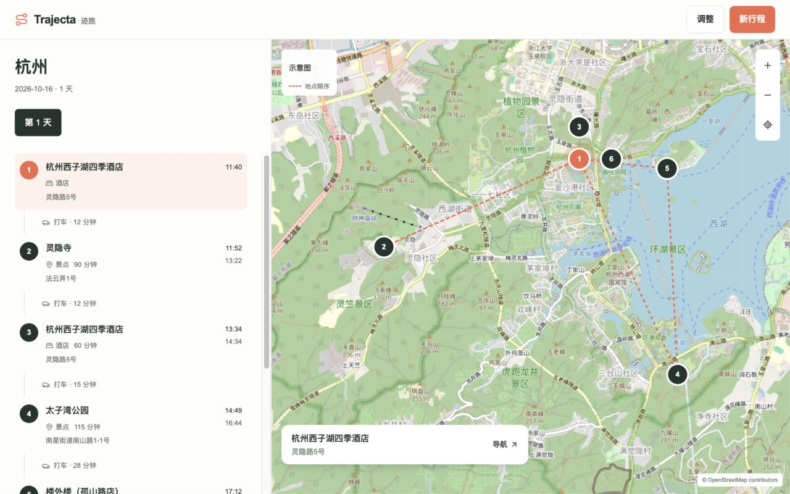
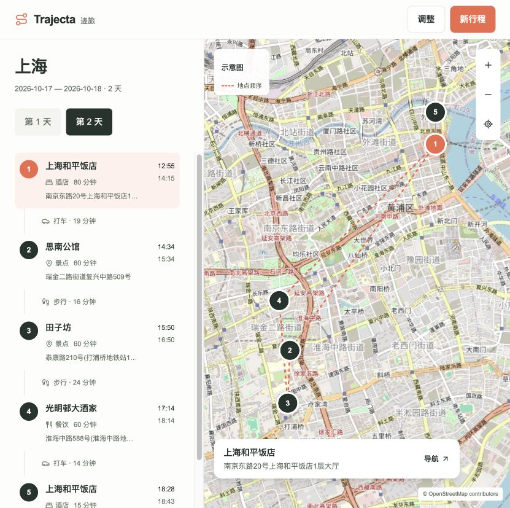

# 桌面界面验收 · 2026-10-02

界面参考 [Wanderlog](https://wanderlog.com/en) 的行程与地图同屏结构，使用 finesse-ui 产品界面设计流程。结果页采用固定日期栏、独立滚动时间轴与全高地图；“调整”打开右侧抽屉。依据区块、资料取舍原文、每日重复标题、介绍副标题及过程日志已移除。零停留节点只显示一个时间。

通过 Codex In-app Browser 检查实际页面，包含 1280×800 和 831×827 电脑视口。831px 下列宽为 332.4px / 498.6px，页面无横向溢出。杭州真实规划用于 1280px 截图；最终上海两日规划用于最新桌面截图和日期切换验收。

| 项目 | 实际结果 |
|---|---|
| 输入图标与文字 | 城市文字位于图标右侧，日期、天数和资料区对齐 |
| 日期与标题栏 | 选择末尾地点后城市标题仍位于 y=88px，日期切换保持可见 |
| 相同坐标 | 酒店出发、休息和返回标记分开，分别可选；细引线指向真实位置 |
| 时间轴与地图 | 两侧选中状态一致，地图选择定位对应时间轴节点 |
| 地图操作 | 拖动实测位移约 100×50px；放大、缩小和全部地点复位可用 |
| 调整抽屉 | 输入区域对齐，Escape 关闭后焦点返回调整按钮 |
| 文案清理 | DOM 中“依据”匹配数为 0；页面不展示来源摘要和内部取舍理由 |
| 浏览器日志 | 本轮最终页面无 error / warn |

[831px 电脑页面](./evidence/2026-10-02-round2/screenshots/after-desktop-831.jpg) · [调整抽屉](./evidence/2026-10-02-round2/screenshots/after-desktop-drawer.jpg) · [改造前截图](./evidence/2026-10-02-round2/screenshots/before-desktop.jpg)

本地验证：后端 206 项检查和 Python 编译通过，前端 13 项检查、TypeScript 及生产构建通过。机器记录位于 [local-validation.json](./evidence/2026-10-02-round2/local-validation.json)。模型真实运行、原始交付、路线复核及额度记录位于 [本轮证据目录](./evidence/2026-10-02-round2/)。

最终预览使用上海真实运行的临时联调数据库：`/tmp/trajecta-round2-live-20261002/databases/round2-sh-two-day.sqlite3`。

[打开最终行程](http://localhost:3000/?workspace=shadow-round2-sh-two-day-round2-20261002&run=run-ffd18810-f23b-45b8-8e36-3d64b794ea89)。最终第二天为 12:55–18:43，共 5 小时 48 分钟。页面中的“依据”与操作性说明匹配数均为 0。

[共性架构改造与验证](./SYSTEMIC_FIXES_2026-10-03.md)。
